# Design

This document contains important information to consider when modifying code in the `haproxy-template-ingress-controller`.

## Considerations

### Assumptions

This software acts as ingress controller for a fleet of HAProxy load-balancers.
It continuously watches a list of user-defined Kubernetes resource types and uses that as input to render the HAProxy
main configuration file `haproxy.cfg` via templating engine and an optional amount of auxiliary files like custom error pages (`500.http`)
or map files for lookups (`host.map`).
After rendering the files they are validated and pushed via HAProxy Dataplane API (https://www.haproxy.com/documentation/haproxy-data-plane-api/).
By pushing only changed config parts via specialized API endpoints we can prevent unnecessary HAProxy reloads.
Many specialized endpoints use the HAProxy runtime socket (https://www.haproxy.com/documentation/haproxy-runtime-api/)
under the hood and perform changes at runtime.
The template rendering is triggered by changed Kubernetes resources and also after a configurable amount of time being idle.
If any rendered file differs from the rendered files of the last run dataplane a sync is triggered.
If a sync is triggered because the idle timer forced it then the dataplane sync is always performed.

### Constraints

The dataplane API does not support all config statements that the HAProxy config language supports 
(see https://www.haproxy.com/documentation/haproxy-configuration-manual/latest/).
Therefore, only rendered configurations that can be parsed by the dataplane API library
(https://github.com/haproxytech/client-native) are supported.

### System Environment

The software is designed to be run inside a Kubernetes container.
The target dataplane APIs must also run as Kubernetes container with an HAProxy sidecar.
The Kubernetes service account of the ingress controller pod must be able to read all watched configurable resources cluster-wide.

## Architecture


#### Overview

The haproxy-template-ingress-controller is a Kubernetes operator that manages HAProxy load balancer configurations through template-driven configuration generation. The system continuously monitors Kubernetes resources and translates them into HAProxy configuration files using a powerful templating engine.

**Core Capabilities:**

- **Template-Driven Configuration**: Uses a feature-rich template engine to generate HAProxy configurations from Kubernetes resources
- **Dynamic Resource Watching**: Monitors user-defined Kubernetes resource types (Ingress, Service, ConfigMap, custom CRDs)
- **Validation-First Deployment**: All configurations are parsed and validated before deployment to production instances
- **Zero-Reload Optimization**: Leverages HAProxy Runtime API for configuration changes that don't require process reloads
- **Structured Comparison**: Intelligently compares configurations to minimize deployments and maximize use of runtime operations

**Operational Model:**

The controller operates through event-driven coordination:

1. **Resource Watchers** monitor Kubernetes resources and publish change events to EventBus
2. **Reconciler** subscribes to change events, debounces rapid changes, and publishes reconciliation trigger events
3. **Executor** subscribes to reconciliation events and orchestrates pure components:
   - **Indexer** maintains O(1) lookup collections
   - **Renderer** generates HAProxy configuration and auxiliary files from templates
   - **Validator** performs two-phase validation (client-native parser + haproxy binary)
   - **Deployer** applies validated configuration using structured comparison for optimal deployment strategy
4. **EventBus** coordinates all component interactions through pub/sub pattern
5. All components publish completion/failure events for observability and further coordination

**Key Design Principles:**

- **Fail-Safe**: Invalid configurations are rejected before reaching production
- **Performance**: Debouncing prevents rapid successive renders, indexing enables fast lookups
- **Observability**: Comprehensive metrics (Prometheus) and distributed tracing (OpenTelemetry)
- **Flexibility**: Templates provide complete control over HAProxy configuration, no annotation limitations

#### Component Diagrams

##### High-Level System Components

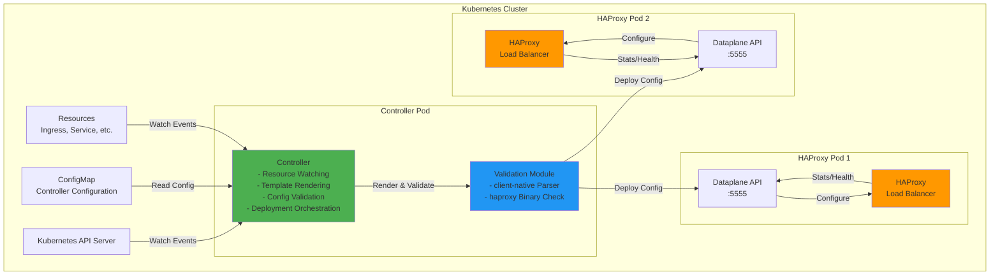

**Component Descriptions:**

- **Controller**: Main controller process that watches Kubernetes resources, renders templates, and orchestrates configuration deployment
- **Validation Module**: Integrated validation using haproxytech/client-native library for parsing and haproxy binary for configuration checks
- **Dataplane API**: HAProxy's management interface for receiving configuration updates and performing runtime operations
- **HAProxy**: Production load balancer instances that serve traffic

##### Controller Internal Architecture

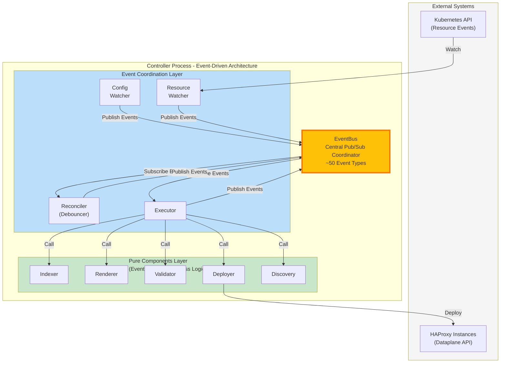

**Event-Driven Data Flow:**

1. **Config/Resource Watchers** receive Kubernetes changes and publish events to EventBus
2. **Reconciler** subscribes to change events, debounces rapid changes, and triggers reconciliation via events
3. **Executor** subscribes to reconciliation events and orchestrates pure components
4. **Pure Components** (Indexer, Renderer, Validator, Deployer, Discovery) perform business logic without event knowledge
5. **Executor** publishes completion/failure events back to EventBus for observability
6. All components can subscribe to events for metrics, logging, and coordination

**Key Architecture Properties:**

- **EventBus** is the single coordination mechanism - no direct component-to-component calls
- **Pure Components** have no event dependencies - they can be tested independently
- **Event Coordination Layer** handles all pub/sub logic, keeping business logic clean
- **Extensibility** - new features can subscribe to existing events without modifying existing code

##### Validation Flow

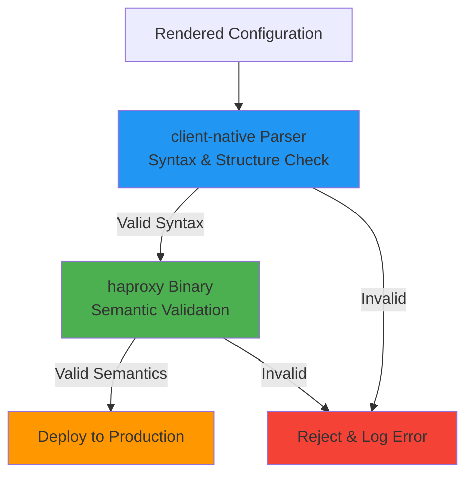

**Validation Strategy:**

The two-phase validation eliminates the need for a separate validation sidecar container:

1. **Phase 1 - Syntax Parsing**: client-native library parses configuration structure and validates against HAProxy config grammar
2. **Phase 2 - Semantic Validation**: haproxy binary (`haproxy -c -f config`) performs full semantic validation including resource availability checks

This approach provides the same validation guarantees as running a full HAProxy instance while being more lightweight and faster.

#### Package Structure

The application is organized into focused Go packages following clean architecture principles:

```
haproxy-template-ic/
├── cmd/
│   └── controller/          # Main entry point
│       └── main.go
├── pkg/
│   ├── core/                # Core functionality
│   │   ├── config/          # Configuration loading and validation
│   │   └── logging/         # Structured logging setup
│   ├── dataplane/           # HAProxy Dataplane API integration
│   │   ├── auxiliaryfiles/  # Auxiliary file management (general, SSL, maps)
│   │   ├── client/          # API client with transactions and retries
│   │   ├── comparator/      # Fine-grained config comparison
│   │   │   └── sections/    # Section-specific comparators (30+ files)
│   │   ├── parser/          # Config parser using client-native
│   │   ├── synchronizer/    # Operation execution logic
│   │   ├── types/           # Public types (Endpoint, SyncOptions, etc.)
│   │   ├── config.go        # Public types (Endpoint, SyncOptions)
│   │   ├── dataplane.go     # Public API (Client, Sync, DryRun, Diff)
│   │   ├── errors.go        # Structured error types
│   │   ├── orchestrator.go  # Sync workflow orchestration
│   │   └── result.go        # Result types
│   ├── events/              # Event bus infrastructure
│   │   ├── bus.go           # EventBus with startup coordination
│   │   └── request.go       # Scatter-gather pattern
│   ├── k8s/                 # Kubernetes integration
│   │   ├── types/           # Core interfaces and types
│   │   ├── client/          # Kubernetes client wrapper with dynamic client
│   │   ├── indexer/         # JSONPath key extraction and field filtering
│   │   ├── store/           # Memory and cached store implementations
│   │   └── watcher/         # Resource watching with debouncing and sync tracking
│   ├── controller/          # Controller lifecycle
│   │   ├── commentator/     # Event commentator for domain-aware logging
│   │   ├── configchange/    # Configuration change handler
│   │   ├── configloader/    # Config parsing and loading
│   │   ├── credentialsloader/ # Credentials parsing and loading
│   │   ├── events/          # Domain-specific event types
│   │   ├── executor/        # Reconciliation orchestrator
│   │   ├── indextracker/    # Index synchronization tracking
│   │   ├── reconciler/      # Reconciliation debouncer and trigger
│   │   ├── resourcewatcher/ # Resource watcher lifecycle management
│   │   ├── validator/       # Config validation (basic, template, jsonpath)
│   │   └── controller.go    # Event coordination and startup orchestration
│   └── templating/          # Template engine library
│       ├── engine.go        # TemplateEngine with pre-compilation and rendering
│       ├── types.go         # Engine type definitions (EngineTypeGonja)
│       ├── errors.go        # Custom error types
│       ├── engine_test.go   # Unit tests
│       └── README.md        # Usage documentation
├── internal/                # Internal packages
│   └── signals/             # Signal handling
└── tools/                   # Development tools
    └── linters/             # Custom linters
        └── eventimmutability/  # Event pointer receiver linter
            ├── analyzer.go  # Custom golangci-lint analyzer
            ├── analyzer_test.go
            └── README.md
```

##### Package Responsibilities

**Core Packages:**

- `pkg/core/config`: Provides pure functions for parsing configuration from YAML strings and loading credentials from Kubernetes Secret data. Includes basic structural validation (port ranges, required fields). Does NOT implement watchers - the controller package instantiates watchers from pkg/k8s and coordinates validation using scatter-gather pattern.
- `pkg/core/logging`: Structured logging setup using Go's standard library `log/slog` package with configurable levels and formats

**Event Bus Infrastructure:**

- `pkg/events`: Generic event bus providing pub/sub and request-response (scatter-gather) patterns for component coordination. Domain-agnostic infrastructure that could be extracted as standalone library.

**Dataplane Integration:**

- `pkg/dataplane`: Public API providing Client interface and convenience functions (Sync, DryRun, Diff)
- `pkg/dataplane/orchestrator`: Coordinates complete sync workflow (parse → compare → sync → auxiliary files)
- `pkg/dataplane/parser`: Wraps haproxytech/client-native for syntax validation and structured config parsing
- `pkg/dataplane/comparator`: Performs fine-grained section-by-section comparison to generate minimal change operations
- `pkg/dataplane/comparator/sections`: Section-specific comparison logic for all HAProxy config sections (global, defaults, frontends, backends, servers, ACLs, rules, binds, filters, checks, etc.)
- `pkg/dataplane/synchronizer`: Executes operations with transaction management and retry logic
- `pkg/dataplane/auxiliaryfiles`: Manages auxiliary files (general files, SSL certificates, map files) with 3-phase sync: pre-config (create/update), config sync, post-config (delete)
- `pkg/dataplane/client`: HTTP client wrapper for Dataplane API with version conflict handling, transaction lifecycle, and storage API integration
- `pkg/dataplane/types`: Public types used across dataplane package (Endpoint, SyncOptions, Result types)

**Kubernetes Integration:**

- `pkg/k8s/types`: Core interfaces and types for the k8s package
  - `Store` interface for resource indexing (Get, List, Add, Update, Delete, Clear)
  - `WatcherConfig` for configuring bulk resource watching with filters, indexing, and callbacks
  - `SingleWatcherConfig` for configuring single named resource watching (ConfigMap, Secret, etc.)
  - `OnChangeCallback` and `OnSyncCompleteCallback` for bulk watcher change notifications
  - `OnResourceChangeCallback` for single resource watcher immediate callbacks
  - `ChangeStats` for tracking resource changes with initial sync context
  - `StoreType` enum for memory vs cached store selection
- `pkg/k8s/client`: Kubernetes client wrapper with dynamic client support
  - Wraps kubernetes.Interface and dynamic.Interface
  - Auto-detects in-cluster vs out-of-cluster configuration
  - Provides namespace detection from service account token
- `pkg/k8s/indexer`: JSONPath evaluation and field filtering
  - Extracts index keys from resources using JSONPath expressions (e.g., `metadata.namespace`, `metadata.labels['key']`)
  - Removes unnecessary fields to reduce memory usage (e.g., `metadata.managedFields`)
  - Fail-fast validation of JSONPath expressions at startup
- `pkg/k8s/store`: Store implementations for indexed resource storage
  - `MemoryStore`: Fast in-memory storage with complete resources (default)
  - `CachedStore`: Memory-efficient storage with API-backed fetches and TTL caching (for large resources like Secrets)
  - Thread-safe with RWMutex for concurrent access
  - O(1) lookups using composite keys from multiple index expressions
- `pkg/k8s/watcher`: High-level resource watching with two watcher types
  - **Watcher** (bulk resource watching): For watching collections of resources (Ingress, Service, EndpointSlice)
    - Uses SharedInformerFactory for efficient resource watching
    - Supports namespace and label selector filtering
    - Debounces rapid changes with configurable interval (default 500ms)
    - Indexed storage with O(1) lookups using JSONPath expressions
    - Tracks initial sync state with `OnSyncComplete` callback and `IsInitialSync` flag
    - Provides `WaitForSync()` and `IsSynced()` for manual synchronization control
    - Supports incremental or bulk processing during initial sync via `CallOnChangeDuringSync`
  - **SingleWatcher** (single resource watching): For watching one specific named resource (ConfigMap, Secret)
    - Lightweight implementation with no indexing or store overhead
    - Watches single resource by namespace + name using field selector
    - Immediate callbacks (no debouncing) with `OnResourceChangeCallback`
    - Ideal for controller configuration (ConfigMap) and credentials (Secret)
    - Provides `WaitForSync()` and `IsSynced()` for startup coordination

**Initial Synchronization Handling:**

The k8s package provides comprehensive support for distinguishing between initial bulk loading of pre-existing resources and real-time changes:

- **Sync Tracking**: Watcher tracks initial sync state internally and provides sync status via `IsSynced()` method
- **OnSyncComplete Callback**: Called once after initial sync completes with the fully populated store and resource count
- **IsInitialSync Flag**: ChangeStats includes `IsInitialSync` field to distinguish bulk load events from real-time changes
- **Callback Control**: `CallOnChangeDuringSync` flag allows choosing between:
  - Incremental processing: Receive callbacks during sync with `IsInitialSync=true` for progressive resource handling
  - Bulk processing: Suppress callbacks during sync, receive only `OnSyncComplete` with final state
- **Manual Synchronization**: `WaitForSync(ctx)` blocks until initial sync completes, useful for staged startup
- **Non-Blocking Status**: `IsSynced()` provides non-blocking sync status check

This prevents common pitfalls like rendering HAProxy configuration before all ingresses are loaded, ensuring the system always has complete data before taking action.

**Configuration and Credentials Management:**

The controller monitors two critical single resources using `SingleWatcher`:

1. **Controller Configuration (ConfigMap)**:
   - Contains templates, watched resource definitions, and controller settings
   - Watched using `SingleWatcher` for immediate re-parsing and validation on changes
   - Name and namespace configured via environment variables or auto-detected
   - Parsed using `ParseConfig(configMapData map[string][]byte)` from pkg/core/config
   - Changes trigger scatter-gather validation before becoming active

2. **Controller Credentials (Secret)**:
   - Secret name: Configurable via environment variable (default: haproxy-template-ic-credentials)
   - Contains 4 required keys:
     - `dataplane_username`: Username for HAProxy Dataplane API
     - `dataplane_password`: Password for HAProxy Dataplane API
     - `validation_username`: Username for validation endpoint
     - `validation_password`: Password for validation endpoint
   - Watched using `SingleWatcher` for immediate credential rotation on changes
   - Loaded using `LoadCredentials(secretData map[string][]byte)` from pkg/core/config
   - All fields are required and validated to be non-empty

Both watchers use the event-driven architecture: changes publish events to EventBus, triggering validation (ConfigMap) or credential updates (Secret).

**Controller Logic:**

- `pkg/controller`: Main controller package coordinating startup orchestration and component lifecycle via EventBus
- `pkg/controller/commentator`: Event commentator that subscribes to all events and produces domain-aware log messages with contextual insights using ring buffer for event correlation
- `pkg/controller/configloader`: Loads and parses controller configuration from ConfigMap resources, publishes ConfigParsedEvent
- `pkg/controller/credentialsloader`: Loads and validates credentials from Secret resources, publishes CredentialsUpdatedEvent
- `pkg/controller/configchange`: Handles configuration change events and coordinates reloading of resources
- `pkg/controller/executor`: Orchestrates reconciliation cycles by coordinating pure components. Subscribes to ReconciliationTriggeredEvent and publishes ReconciliationStartedEvent, ReconciliationCompletedEvent, and ReconciliationFailedEvent. Second Stage 5 component that will orchestrate the Renderer, Validator, and Deployer pure components (currently stub implementation establishing event flow). Measures reconciliation duration for observability.
- `pkg/controller/indextracker`: Tracks synchronization state across multiple resource types, publishes IndexSynchronizedEvent when all resources complete initial sync, enabling staged controller startup with clear initialization checkpoints
- `pkg/controller/reconciler`: Debounces resource change events and triggers reconciliation cycles. Subscribes to ResourceIndexUpdatedEvent (applies debouncing with configurable interval, default 500ms) and ConfigValidatedEvent (triggers immediately without debouncing). Publishes ReconciliationTriggeredEvent when conditions are met. Filters initial sync events to prevent premature reconciliation. First Stage 5 component enabling controlled reconciliation trigger logic.
- `pkg/controller/resourcewatcher`: Manages lifecycle of all Kubernetes resource watchers defined in configuration, provides centralized WaitForAllSync() method for coordinated initialization, publishes ResourceIndexUpdatedEvent with detailed change statistics
- `pkg/controller/validator`: Contains validation components (basic structural validation, template syntax validation, JSONPath expression validation) that respond to ConfigValidationRequest events using scatter-gather pattern
- `pkg/controller/events`: Domain-specific event type definitions (~30+ event types covering complete controller lifecycle)

**Template Engine:**

- `pkg/templating`: Low-level template engine library providing template compilation and rendering
  - Pre-compiles templates at initialization for optimal runtime performance
  - Wraps Gonja v2 for Jinja2-compatible template syntax
  - Provides TemplateEngine with Render(templateName, context) API
  - Custom error types for compilation, rendering, and template-not-found scenarios
  - Future: Custom filters (b64decode, get_path) will be integrated into higher-level controller rendering components

**Development Tools:**

- `tools/linters/eventimmutability`: Custom golangci-lint analyzer that enforces event immutability contract
  - Checks that all Event interface method implementations use pointer receivers
  - Prevents accidental struct copying (events often exceed 200 bytes)
  - Integrated into `make lint` and CI pipeline via golangci-lint
  - Provides clear error messages with file locations when violations detected
  - See `tools/linters/eventimmutability/README.md` for details

##### Key Interfaces

```go
// Resource storage (pkg/k8s/types)
type Store interface {
    // Get retrieves all resources matching the provided index keys
    Get(keys ...string) ([]interface{}, error)

    // List returns all resources in the store
    List() ([]interface{}, error)

    // Add inserts a new resource with the provided index keys
    Add(resource interface{}, keys []string) error

    // Update modifies an existing resource
    Update(resource interface{}, keys []string) error

    // Delete removes a resource using its index keys
    Delete(keys ...string) error

    // Clear removes all resources from the store
    Clear() error
}

// Change notification callbacks (pkg/k8s/types)
type OnChangeCallback func(store Store, stats ChangeStats)

type OnSyncCompleteCallback func(store Store, initialCount int)

type ChangeStats struct {
    Created  int  // Number of resources added
    Modified int  // Number of resources updated
    Deleted  int  // Number of resources removed
    IsInitialSync bool  // True during initial synchronization
}

// Template rendering
type TemplateRenderer interface {
    Render(template string, context interface{}) (string, error)
    RenderAll(config models.Config, resources ResourceCollection) (RenderedContext, error)
}

// Configuration validation
type ConfigValidator interface {
    ValidateSyntax(config string) error
    ValidateSemantics(config string) error
}

// Dataplane operations
type DataplaneClient interface {
    GetVersion() (VersionInfo, error)
    DeployConfiguration(config string) (DeploymentResult, error)
    FetchStructuredConfig() (StructuredConfig, error)
    SyncMaps(maps map[string]string) error
    SyncCertificates(certs map[string]string) error
}

// Configuration synchronization
type ConfigSynchronizer interface {
    SyncConfiguration(ctx context.Context, config RenderedContext) (SyncResult, error)
    UpdateEndpoints(endpoints []DataplaneEndpoint) error
}
```

#### Sequence Diagrams

##### Startup and Initialization

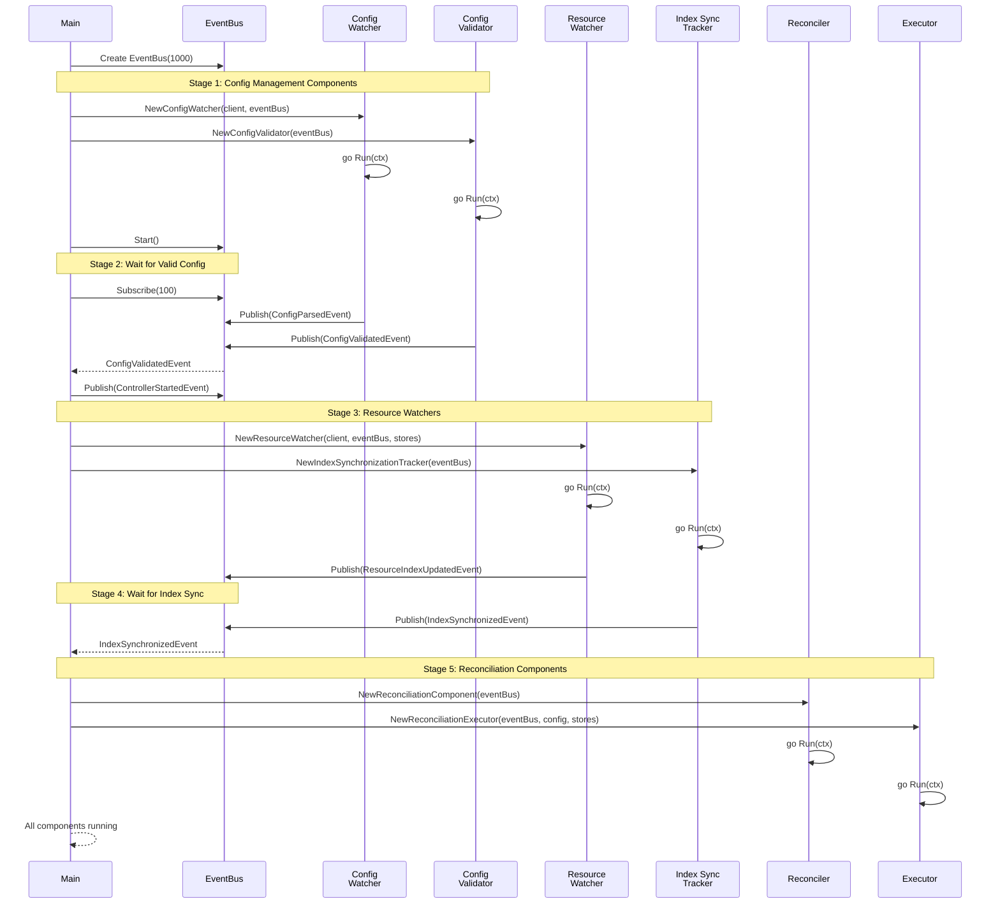

**Event-Driven Startup Flow:**

1. **Stage 1 - Config Management**: Start ConfigWatcher and ConfigValidator as goroutines (they subscribe to EventBus), then call EventBus.Start() to replay any buffered events and enter normal operation mode
2. **Stage 2 - Wait for Valid Config**: Main subscribes to EventBus and blocks until ConfigValidatedEvent is received
3. **Stage 3 - Resource Watchers**: Start ResourceWatcher and IndexSynchronizationTracker to monitor Kubernetes resources
4. **Stage 4 - Wait for Index Sync**: Block until IndexSynchronizedEvent confirms all resource indices are populated
5. **Stage 5 - Reconciliation**: Start Reconciler and Executor to handle template rendering and deployment

The EventBus.Start() call after Stage 1 ensures all initial components have subscribed before events flow, preventing race conditions during initialization. All coordination happens via EventBus pub/sub - components communicate through events, not direct calls.

##### Resource Change Handling

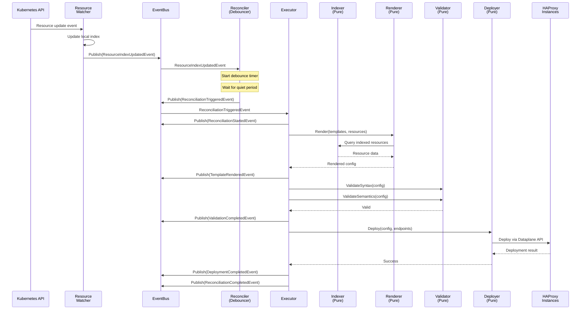

**Event-Driven Flow:**

1. **Resource Change**: ResourceWatcher receives Kubernetes event, updates local index, publishes ResourceIndexUpdatedEvent
2. **Debouncing**: Reconciler subscribes to index events, starts debounce timer to batch rapid changes
3. **Reconciliation Trigger**: After quiet period, Reconciler publishes ReconciliationTriggeredEvent
4. **Orchestration**: Executor subscribes to reconciliation events and orchestrates pure components
5. **Template Rendering**: Executor calls Renderer (pure component) which queries Indexer for resource data
6. **Validation**: Executor calls Validator for syntax and semantic validation
7. **Deployment**: Executor calls Deployer to push validated config to HAProxy instances
8. **Event Propagation**: Executor publishes events at each stage for observability and further coordination

All coordination happens via EventBus pub/sub - pure components have no event dependencies.

##### Configuration Validation Process

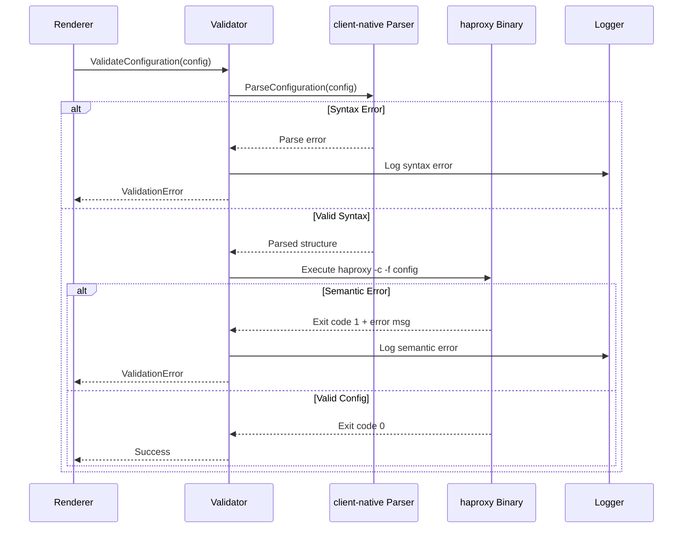

**Validation Steps:**

1. **Syntax Validation**: client-native library parses config structure
   - Checks grammar and syntax rules
   - Validates section structure
   - Returns parsing errors if invalid

2. **Semantic Validation**: haproxy binary performs full validation
   - Checks resource availability
   - Validates directive combinations
   - Verifies configuration coherence
   - Returns detailed error messages if invalid

##### Zero-Reload Deployment Strategy

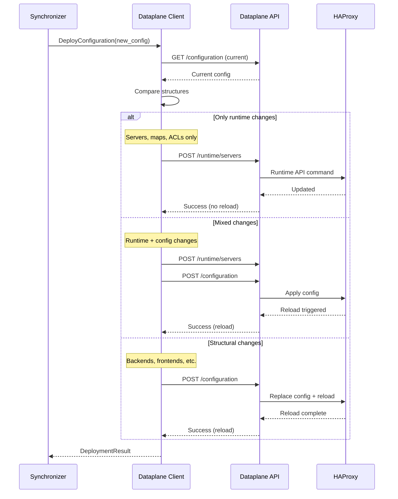

**Deployment Optimization:**

The synchronizer analyzes configuration changes to determine the optimal deployment strategy:

1. **Runtime-Only Updates**: Server additions/removals, map updates, ACL changes → No reload
2. **Mixed Updates**: Apply runtime changes first, then config changes → Single reload
3. **Structural Updates**: Backend/frontend changes → Full reload required

This minimizes service disruption by avoiding unnecessary HAProxy process reloads.

#### Deployment Diagrams

##### Kubernetes Deployment Architecture

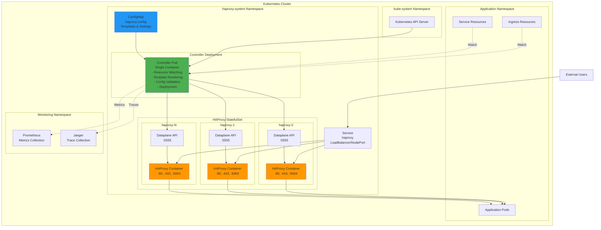

**Deployment Components:**

1. **Controller Deployment**: Single replica deployment running the operator
   - Watches Kubernetes resources cluster-wide
   - Renders templates and validates configurations
   - Deploys to HAProxy instances via Dataplane API
   - Exposes metrics and health endpoints

2. **HAProxy StatefulSet**: Multiple replicas for high availability
   - Each pod runs HAProxy + Dataplane API sidecar
   - Service selector targets HAProxy pods for traffic routing
   - Scales horizontally based on load

3. **ConfigMap**: Contains controller configuration
   - Template definitions (haproxy.cfg, maps, certificates)
   - Watched resource types and indexing configuration
   - Rendering and deployment settings

##### Container Architecture

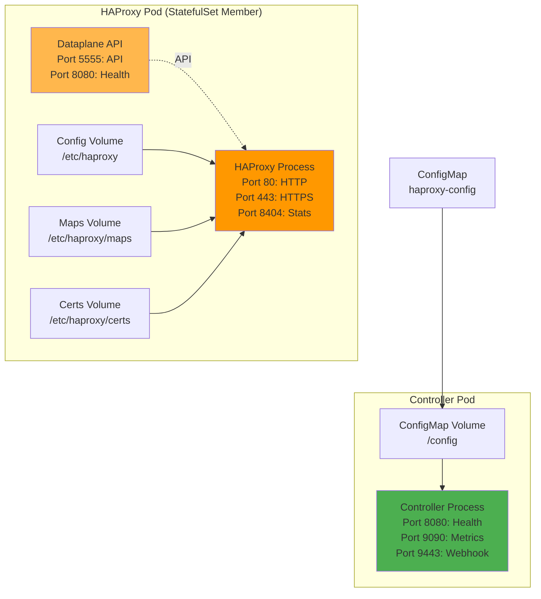

**Resource Requirements:**

Controller Pod:
- CPU: 100m request, 500m limit
- Memory: 128Mi request, 512Mi limit
- Volumes: ConfigMap mount for configuration

HAProxy Pod:
- HAProxy Container: 200m CPU, 256Mi memory (per instance)
- Dataplane API Container: 100m CPU, 128Mi memory
- Volumes: EmptyDir for dynamic configs, maps, and certificates

##### Network Topology

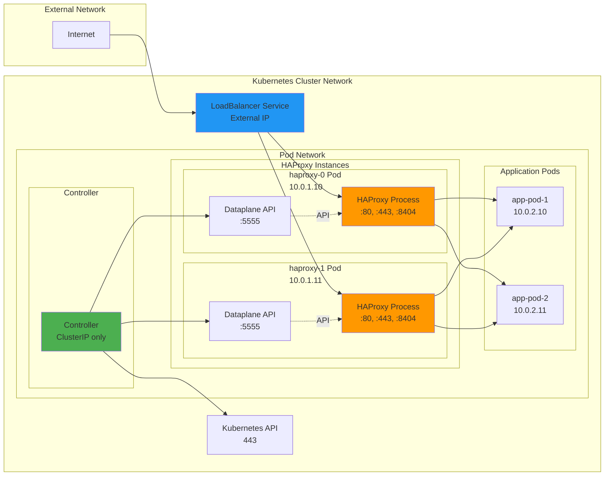

**Network Flow:**

1. **Ingress Traffic**: Internet → LoadBalancer → HAProxy Pods → Application Pods
2. **Control Plane**: Controller → Kubernetes API (resource watching)
3. **Configuration Deployment**: Controller → Dataplane API endpoints (HTTP)
4. **Service Discovery**: Controller watches HAProxy pods via Kubernetes API

**Scaling Considerations:**

- **Horizontal Scaling**: Increase HAProxy StatefulSet replicas for more capacity
- **Controller Scaling**: Single active controller (leader election for HA in future)
- **Resource Limits**: Adjust based on number of watched resources and template complexity
- **Network**: Ensure LoadBalancer can distribute traffic across all HAProxy replicas

#### Key Design Decisions

##### Configuration Validation Strategy

**Decision**: Use two-phase validation (client-native parser + haproxy binary) instead of running a full validation sidecar.

**Rationale**:
- **Performance**: Parser validation is fast (~10ms), binary validation completes in ~50-100ms
- **Resource Efficiency**: No additional HAProxy container needed (saves ~256Mi memory per controller pod)
- **Simplicity**: Single container deployment reduces complexity
- **Reliability**: Same validation guarantees as full HAProxy instance

**Implementation**:
```go
// Validation is implemented in pkg/dataplane/parser (client-native integration)
// and by invoking haproxy binary for semantic validation
type ConfigValidator struct {
    parser *clientnative.Parser
    haproxyBinary string
}

func (v *ConfigValidator) Validate(config string) error {
    // Phase 1: Syntax validation with client-native
    if err := v.parser.ParseConfiguration(config); err != nil {
        return fmt.Errorf("syntax error: %w", err)
    }

    // Phase 2: Semantic validation with haproxy binary
    cmd := exec.Command(v.haproxyBinary, "-c", "-f", "-")
    cmd.Stdin = strings.NewReader(config)
    if err := cmd.Run(); err != nil {
        return fmt.Errorf("semantic error: %w", err)
    }

    return nil
}
```

**Parser Improvements**:

The config parser (`pkg/dataplane/parser`) has been enhanced to correctly handle all HAProxy global directives:

1. **Fixed Log Target Parsing**: Previously, the parser incorrectly treated `log-send-hostname` as a log target
   - Now correctly identifies log targets: lines starting with "log" followed by an address
   - Properly classifies `log-send-hostname` as a general global directive (not a log target)
   - Example valid config now parses correctly:
     ```
     global
         log stdout local0
         log-send-hostname
     ```

2. **Improved Directive Classification**: Enhanced logic to distinguish between:
   - Log targets: `log <address> <facility> [level]`
   - Log options: `log-send-hostname`, `log-tag`, etc.
   - Other global directives

3. **Better Error Messages**: Parser now provides clearer error messages when encountering unsupported directives

This fix resolves issues where valid HAProxy configurations were rejected during the parsing phase of validation.

##### Template Engine Selection

**Decision**: Use a Jinja2-like template engine for Go with rich feature set.

**Candidates Evaluated**:
1. **gonja v2**: Pure Go Jinja2 implementation, actively maintained (v2.4.1, January 2025)
2. **pongo2**: Django/Jinja2 syntax, comprehensive but last release 2022
3. **text/template**: Go stdlib, limited features, verbose syntax
4. **jet**: Fast, but different syntax paradigm

**Selected**: gonja v2 (github.com/nikolalohinski/gonja/v2)

**Rationale**:
- **Active Maintenance**: Latest release v2.4.1 (January 2025), ongoing development
- **Jinja2 Compatibility**: Aims for maximum compatibility with Python's Jinja2 engine
- **Familiarity**: Jinja2 syntax is well-known in operations community
- **Features**: Full feature set including filters, macros, template inheritance, control flow
- **Extensibility**: Easy to add custom filters (b64decode, get_path, etc.)
- **Pure Go**: No external dependencies, requires Go 1.21+

##### Kubernetes Client Architecture

**Decision**: Use client-go with SharedInformerFactory for resource watching, no heavy controller framework.

**Rationale**:
- **Control**: Direct control over informer lifecycle and event handling
- **Flexibility**: Custom indexing logic without framework constraints
- **Performance**: Optimized cache and index management
- **Simplicity**: No code generation, no framework-imposed structure

**Implementation Pattern**:
```go
// Slim approach using client-go
factory := informers.NewSharedInformerFactory(clientset, resyncPeriod)

// Add informers for each watched resource type
for _, resource := range config.WatchedResources {
    gvr := schema.GroupVersionResource{...}
    informer := factory.ForResource(gvr)

    informer.Informer().AddEventHandler(cache.ResourceEventHandlerFuncs{
        AddFunc:    handleAdd,
        UpdateFunc: handleUpdate,
        DeleteFunc: handleDelete,
    })
}

factory.Start(stopCh)
```

##### Concurrency Model

**Decision**: Use Go routines and channels for async operations with structured concurrency.

**Key Patterns**:

1. **Event Processing**: Buffered channels for event debouncing
   ```go
   type Debouncer struct {
       events chan Event
       timer  *time.Timer
   }
   ```

2. **Parallel Deployment**: Worker pools for deploying to multiple HAProxy instances
   ```go
   var wg sync.WaitGroup
   for _, endpoint := range endpoints {
       wg.Add(1)
       go func(ep DataplaneEndpoint) {
           defer wg.Done()
           deploy(ep)
       }(endpoint)
   }
   wg.Wait()
   ```

3. **Context Propagation**: All operations use context.Context for cancellation
   ```go
   func (s *Synchronizer) Deploy(ctx context.Context, config Config) error {
       ctx, cancel := context.WithTimeout(ctx, 30*time.Second)
       defer cancel()
       // ... deployment logic
   }
   ```

##### Observability Integration

**Decision**: Prometheus metrics + OpenTelemetry tracing with standardized naming.

**Metrics Design**:
```go
// Counter for template renders
renderCounter := prometheus.NewCounterVec(
    prometheus.CounterOpts{
        Name: "haproxy_template_ic_renders_total",
        Help: "Total number of template renders",
    },
    []string{"status"}, // success, error
)

// Histogram for deployment duration
deployDuration := prometheus.NewHistogramVec(
    prometheus.HistogramOpts{
        Name:    "haproxy_template_ic_deploy_duration_seconds",
        Help:    "Duration of configuration deployments",
        Buckets: prometheus.DefBuckets,
    },
    []string{"instance", "method"}, // method: runtime, structured, reload
)
```

**Tracing Integration**:
```go
import "go.opentelemetry.io/otel"

func (r *Renderer) Render(ctx context.Context, tpl string) (string, error) {
    ctx, span := otel.Tracer("haproxy-template-ic").Start(ctx, "render_template")
    defer span.End()

    span.SetAttributes(
        attribute.Int("template_size", len(tpl)),
    )

    // ... rendering logic

    return result, nil
}
```

##### Error Handling Strategy

**Decision**: Structured errors with context using standard library errors package and custom error types.

**Pattern**:
```go
// Custom error types for different failure modes
type ValidationError struct {
    ConfigSize int
    Line       int
    Details    string
    Err        error
}

func (e *ValidationError) Error() string {
    return fmt.Sprintf("validation failed at line %d: %s", e.Line, e.Details)
}

func (e *ValidationError) Unwrap() error {
    return e.Err
}

// Usage with error wrapping
func validate(config string) error {
    if err := parser.Parse(config); err != nil {
        return &ValidationError{
            ConfigSize: len(config),
            Details:    "syntax error",
            Err:        err,
        }
    }
    return nil
}
```

##### Event-Driven Architecture

**Decision**: Implement event-driven architecture for component decoupling and extensibility.

**Rationale**:
- **Decoupling**: Components communicate via events, not direct calls
- **Extensibility**: New features can be added without modifying existing code
- **Observability**: Complete system visibility through event stream
- **Testability**: Pure components without event dependencies
- **Maintainability**: Clear separation between business logic and coordination

**Architecture Pattern**:

The architecture uses a **pure components + event adapter** pattern:

```
Component Architecture:
├── Pure Components (business logic, no event dependencies)
│   ├── ConfigLoader
│   ├── ValidationHandler
│   ├── TemplateRenderer
│   ├── DeploymentExecutor
│   └── ResourceIndexer
│
└── Event Adapters (single layer wrapping pure components)
    ├── Publish events on state changes
    ├── Subscribe to relevant events
    └── Coordinate component interactions
```

**Homegrown Event Bus Implementation**:

```go
// pkg/events/bus.go
package events

import "sync"

// Event interface for type safety and immutability
//
// All event types MUST use pointer receivers for Event interface methods.
// This avoids copying large structs (200+ bytes) and follows Go best practices.
//
// All event types MUST implement both methods:
//   - EventType() returns the unique event type string
//   - Timestamp() returns when the event was created
//
// Events are immutable after creation. Constructor functions perform defensive
// copying of slices and maps to prevent post-publication mutation.
type Event interface {
    EventType() string
    Timestamp() time.Time
}

// EventBus provides pub/sub coordination with startup coordination.
//
// Startup Coordination:
// Events published before Start() is called are buffered and replayed after Start().
// This prevents race conditions during component initialization where events might
// be published before all subscribers have connected.
type EventBus struct {
    subscribers []chan Event
    mu          sync.RWMutex

    // Startup coordination
    started        bool
    startMu        sync.Mutex
    preStartBuffer []Event
}

// NewEventBus creates a new EventBus.
//
// The bus starts in buffering mode - events published before Start() is called
// will be buffered and replayed when Start() is invoked.
//
// The capacity parameter sets the initial buffer size for pre-start events.
// Recommended: 100 for most applications.
func NewEventBus(capacity int) *EventBus {
    return &EventBus{
        subscribers:    make([]chan Event, 0),
        started:        false,
        preStartBuffer: make([]Event, 0, capacity),
    }
}

// Publish sends event to all subscribers.
//
// If Start() has not been called yet, the event is buffered and will be
// replayed when Start() is invoked. After Start() is called, this is a
// non-blocking operation that drops events to lagging subscribers.
//
// Returns the number of subscribers that received the event.
// Returns 0 if event was buffered (before Start()).
func (b *EventBus) Publish(event Event) int {
    // Check if bus has started
    b.startMu.Lock()
    if !b.started {
        // Buffer event for replay after Start()
        b.preStartBuffer = append(b.preStartBuffer, event)
        b.startMu.Unlock()
        return 0
    }
    b.startMu.Unlock()

    // Bus has started - publish to subscribers
    b.mu.RLock()
    defer b.mu.RUnlock()

    sent := 0
    for _, ch := range b.subscribers {
        select {
        case ch <- event:
            sent++
        default:
            // Channel full, subscriber lagging - drop event
        }
    }
    return sent
}

// Subscribe creates new event channel
func (b *EventBus) Subscribe(bufferSize int) <-chan Event {
    b.mu.Lock()
    defer b.mu.Unlock()

    ch := make(chan Event, bufferSize)
    b.subscribers = append(b.subscribers, ch)
    return ch
}

// Start releases all buffered events and switches the bus to normal operation mode.
//
// This method should be called after all components have subscribed to the bus
// during application startup. It ensures that no events are lost during the
// initialization phase.
//
// Behavior:
//  1. Marks the bus as started
//  2. Replays all buffered events to subscribers in order
//  3. Clears the buffer
//  4. All subsequent Publish() calls go directly to subscribers
//
// This method is idempotent - calling it multiple times has no additional effect.
func (b *EventBus) Start() {
    b.startMu.Lock()
    defer b.startMu.Unlock()

    // Idempotent - return if already started
    if b.started {
        return
    }

    // Mark as started (must be done before replaying to avoid recursion)
    b.started = true

    // Replay buffered events to subscribers
    if len(b.preStartBuffer) > 0 {
        b.mu.RLock()
        subscribers := b.subscribers
        b.mu.RUnlock()

        for _, event := range b.preStartBuffer {
            // Publish each buffered event
            for _, ch := range subscribers {
                select {
                case ch <- event:
                    // Event sent
                default:
                    // Channel full - drop event (same behavior as normal Publish)
                }
            }
        }

        // Clear buffer
        b.preStartBuffer = nil
    }
}
```

**Event Type Definitions**:

```go
// pkg/events/types.go
package events

// Event categories covering complete controller lifecycle
//
// All events use pointer receivers and include private timestamp fields.
// Constructor functions (New*Event) perform defensive copying of slices/maps.

// Lifecycle Events
type ControllerStartedEvent struct {
    ConfigVersion  string
    SecretVersion  string
    timestamp      time.Time
}

func NewControllerStartedEvent(configVersion, secretVersion string) *ControllerStartedEvent {
    return &ControllerStartedEvent{
        ConfigVersion: configVersion,
        SecretVersion: secretVersion,
        timestamp:     time.Now(),
    }
}

func (e *ControllerStartedEvent) EventType() string    { return "controller.started" }
func (e *ControllerStartedEvent) Timestamp() time.Time { return e.timestamp }

type ControllerShutdownEvent struct {
    Reason    string
    timestamp time.Time
}

func NewControllerShutdownEvent(reason string) *ControllerShutdownEvent {
    return &ControllerShutdownEvent{
        Reason:    reason,
        timestamp: time.Now(),
    }
}

func (e *ControllerShutdownEvent) EventType() string    { return "controller.shutdown" }
func (e *ControllerShutdownEvent) Timestamp() time.Time { return e.timestamp }

// Configuration Events
type ConfigParsedEvent struct {
    Config        interface{}
    Version       string
    SecretVersion string
    timestamp     time.Time
}

func NewConfigParsedEvent(config interface{}, version, secretVersion string) *ConfigParsedEvent {
    return &ConfigParsedEvent{
        Config:        config,
        Version:       version,
        SecretVersion: secretVersion,
        timestamp:     time.Now(),
    }
}

func (e *ConfigParsedEvent) EventType() string    { return "config.parsed" }
func (e *ConfigParsedEvent) Timestamp() time.Time { return e.timestamp }

type ConfigValidatedEvent struct {
    Config        interface{}
    Version       string
    SecretVersion string
    timestamp     time.Time
}

func NewConfigValidatedEvent(config interface{}, version, secretVersion string) *ConfigValidatedEvent {
    return &ConfigValidatedEvent{
        Config:        config,
        Version:       version,
        SecretVersion: secretVersion,
        timestamp:     time.Now(),
    }
}

func (e *ConfigValidatedEvent) EventType() string    { return "config.validated" }
func (e *ConfigValidatedEvent) Timestamp() time.Time { return e.timestamp }

type ConfigInvalidEvent struct {
    Version          string
    ValidationErrors map[string][]string // validator name -> errors
    timestamp        time.Time
}

// NewConfigInvalidEvent creates a new ConfigInvalidEvent with defensive copying
func NewConfigInvalidEvent(version string, validationErrors map[string][]string) *ConfigInvalidEvent {
    // Defensive copy of map with slice values
    errorsCopy := make(map[string][]string, len(validationErrors))
    for k, v := range validationErrors {
        if len(v) > 0 {
            vCopy := make([]string, len(v))
            copy(vCopy, v)
            errorsCopy[k] = vCopy
        }
    }

    return &ConfigInvalidEvent{
        Version:          version,
        ValidationErrors: errorsCopy,
        timestamp:        time.Now(),
    }
}

func (e *ConfigInvalidEvent) EventType() string    { return "config.invalid" }
func (e *ConfigInvalidEvent) Timestamp() time.Time { return e.timestamp }

// Resource Events
type ResourceIndexUpdatedEvent struct {
    // ResourceTypeName identifies the resource type from config (e.g., "ingresses", "services").
    ResourceTypeName string

    // ChangeStats provides detailed change statistics including Created, Modified, Deleted counts
    // and whether this event occurred during initial sync.
    ChangeStats types.ChangeStats

    timestamp time.Time
}

func NewResourceIndexUpdatedEvent(resourceTypeName string, changeStats types.ChangeStats) *ResourceIndexUpdatedEvent {
    return &ResourceIndexUpdatedEvent{
        ResourceTypeName: resourceTypeName,
        ChangeStats:      changeStats,
        timestamp:        time.Now(),
    }
}

func (e *ResourceIndexUpdatedEvent) EventType() string    { return "resource.index.updated" }
func (e *ResourceIndexUpdatedEvent) Timestamp() time.Time { return e.timestamp }

type ResourceSyncCompleteEvent struct {
    // ResourceTypeName identifies the resource type from config (e.g., "ingresses").
    ResourceTypeName string

    // InitialCount is the number of resources loaded during initial sync.
    InitialCount int

    timestamp time.Time
}

func NewResourceSyncCompleteEvent(resourceTypeName string, initialCount int) *ResourceSyncCompleteEvent {
    return &ResourceSyncCompleteEvent{
        ResourceTypeName: resourceTypeName,
        InitialCount:     initialCount,
        timestamp:        time.Now(),
    }
}

func (e *ResourceSyncCompleteEvent) EventType() string    { return "resource.sync.complete" }
func (e *ResourceSyncCompleteEvent) Timestamp() time.Time { return e.timestamp }

type IndexSynchronizedEvent struct {
    // ResourceCounts maps resource types to their counts.
    ResourceCounts map[string]int
    timestamp      time.Time
}

// NewIndexSynchronizedEvent creates a new IndexSynchronizedEvent with defensive copying
func NewIndexSynchronizedEvent(resourceCounts map[string]int) *IndexSynchronizedEvent {
    // Defensive copy of map
    countsCopy := make(map[string]int, len(resourceCounts))
    for k, v := range resourceCounts {
        countsCopy[k] = v
    }

    return &IndexSynchronizedEvent{
        ResourceCounts: countsCopy,
        timestamp:      time.Now(),
    }
}

func (e *IndexSynchronizedEvent) EventType() string    { return "index.synchronized" }
func (e *IndexSynchronizedEvent) Timestamp() time.Time { return e.timestamp }

// Reconciliation Events
type ReconciliationTriggeredEvent struct {
    Reason    string
    timestamp time.Time
}

func NewReconciliationTriggeredEvent(reason string) *ReconciliationTriggeredEvent {
    return &ReconciliationTriggeredEvent{
        Reason:    reason,
        timestamp: time.Now(),
    }
}

func (e *ReconciliationTriggeredEvent) EventType() string    { return "reconciliation.triggered" }
func (e *ReconciliationTriggeredEvent) Timestamp() time.Time { return e.timestamp }

type ReconciliationStartedEvent struct {
    Trigger   string
    timestamp time.Time
}

func NewReconciliationStartedEvent(trigger string) *ReconciliationStartedEvent {
    return &ReconciliationStartedEvent{
        Trigger:   trigger,
        timestamp: time.Now(),
    }
}

func (e *ReconciliationStartedEvent) EventType() string    { return "reconciliation.started" }
func (e *ReconciliationStartedEvent) Timestamp() time.Time { return e.timestamp }

type ReconciliationCompletedEvent struct {
    DurationMs int64
    timestamp  time.Time
}

func NewReconciliationCompletedEvent(durationMs int64) *ReconciliationCompletedEvent {
    return &ReconciliationCompletedEvent{
        DurationMs: durationMs,
        timestamp:  time.Now(),
    }
}

func (e *ReconciliationCompletedEvent) EventType() string    { return "reconciliation.completed" }
func (e *ReconciliationCompletedEvent) Timestamp() time.Time { return e.timestamp }

type ReconciliationFailedEvent struct {
    Error     string
    timestamp time.Time
}

func NewReconciliationFailedEvent(err string) *ReconciliationFailedEvent {
    return &ReconciliationFailedEvent{
        Error:     err,
        timestamp: time.Now(),
    }
}

func (e *ReconciliationFailedEvent) EventType() string    { return "reconciliation.failed" }
func (e *ReconciliationFailedEvent) Timestamp() time.Time { return e.timestamp }

// Note: All ~50 event types follow the same pattern:
// - Pointer receivers for EventType() and Timestamp() methods
// - Private timestamp field set in constructor
// - Constructor function (New*Event) that performs defensive copying
// - Exported fields for event data
//
// Additional event categories (not shown for brevity):
// - Template Events (TemplateRenderedEvent, TemplateRenderFailedEvent)
// - Validation Events (ValidationStartedEvent, ValidationCompletedEvent, ValidationFailedEvent)
// - Deployment Events (DeploymentStartedEvent, InstanceDeployedEvent, DeploymentCompletedEvent)
// - Storage Events (StorageSyncStartedEvent, StorageSyncCompletedEvent)
// - HAProxy Discovery Events (HAProxyPodsDiscoveredEvent)
//
// See pkg/controller/events/types.go for complete event catalog.
```

**Event Immutability Contract**:

Events in the system are designed to be immutable after creation, representing historical facts about what happened. The implementation balances practical immutability with Go idioms and performance:

1. **Pointer Receivers**: All Event interface methods use pointer receivers
   - Avoids copying large structs (many events exceed 200 bytes)
   - Follows Go best practices for methods on types with mutable fields
   - Enforced by custom `eventimmutability` linter in `tools/linters/`

2. **Exported Fields**: Event fields are exported for idiomatic Go access
   - Follows industry standards (Kubernetes, NATS)
   - Enables JSON serialization without reflection tricks
   - Relies on team discipline rather than compiler enforcement

3. **Defensive Copying**: Constructors perform defensive copies of slices and maps
   - Publishers cannot modify events after creation
   - Example: `NewConfigInvalidEvent` deep-copies the validation errors map
   - Prevents accidental mutation from affecting published events

4. **Read-Only Discipline**: Consumers must treat events as read-only
   - Enforced through code review and team practices
   - This is an internal project where all consumers are controlled
   - Alternative (unexported fields + getters) would be less idiomatic Go

5. **Custom Linter**: The `eventimmutability` analyzer enforces pointer receivers
   - Integrated into `make lint` and CI pipeline
   - Prevents value receivers that would cause struct copying
   - Located in `tools/linters/eventimmutability/`

This approach provides practical immutability while maintaining clean, idiomatic Go code without the overhead of getters or complex accessor patterns.

**Component with Event Adapter Pattern**:

```go
// pkg/dataplane/client.go - Pure component (no event knowledge)
type DataplaneClient struct {
    endpoints []DataplaneEndpoint
}

func (c *DataplaneClient) DeployConfig(ctx context.Context, config string) error {
    // Pure business logic
    // No event publishing here
    return c.deploy(ctx, config)
}

// pkg/dataplane/adapter.go - Event adapter wrapping pure component
type DataplaneEventAdapter struct {
    client   *DataplaneClient
    eventBus *EventBus
}

func (a *DataplaneEventAdapter) DeployConfig(ctx context.Context, config string) error {
    // Publish start event
    a.eventBus.Publish(DeploymentStartedEvent{
        Endpoints: a.client.endpoints,
    })

    // Call pure component
    err := a.client.DeployConfig(ctx, config)

    // Publish result event
    if err != nil {
        a.eventBus.Publish(DeploymentFailedEvent{Error: err.Error()})
        return err
    }

    a.eventBus.Publish(DeploymentCompletedEvent{
        Total: len(a.client.endpoints),
        Succeeded: len(a.client.endpoints),
        Failed: 0,
    })

    return nil
}
```

**Staged Startup with Event Coordination**:

```go
// cmd/controller/main.go
func main() {
    ctx := context.Background()

    // Create event bus
    eventBus := events.NewEventBus(1000)

    // Stage 1: Config Management Components
    log.Info("Stage 1: Starting config management")

    configWatcher := NewConfigWatcher(client, eventBus)
    configLoader := NewConfigLoader(eventBus)
    configValidator := NewConfigValidator(eventBus)

    go configWatcher.Run(ctx)
    go configLoader.Run(ctx)
    go configValidator.Run(ctx)

    // Start the event bus - ensures all components have subscribed before events flow
    // This prevents race conditions where events are published before subscribers connect
    eventBus.Start()

    // Stage 2: Wait for Valid Config
    log.Info("Stage 2: Waiting for valid configuration")

    events := eventBus.Subscribe(100)
    var config Config

    for {
        select {
        case event := <-events:
            switch e := event.(type) {
            case ConfigValidatedEvent:
                config = e.Config
                log.Info("Valid config received")
                goto ConfigReady
            case ControllerShutdownEvent:
                return
            }
        case <-ctx.Done():
            return
        }
    }

ConfigReady:
    eventBus.Publish(ControllerStartedEvent{
        ConfigVersion: config.Version,
    })

    // Stage 3: Resource Watchers
    log.Info("Stage 3: Starting resource watchers")

    stores := make(map[string]*ResourceStore)
    resourceWatcher := NewResourceWatcher(client, eventBus, config.WatchedResources, stores)

    go resourceWatcher.Run(ctx)

    indexTracker := NewIndexSynchronizationTracker(eventBus, config.WatchedResources)
    go indexTracker.Run(ctx)

    // Stage 4: Wait for Index Sync
    log.Info("Stage 4: Waiting for resource sync")

    for {
        select {
        case event := <-events:
            if _, ok := event.(IndexSynchronizedEvent); ok {
                goto IndexReady
            }
        case <-time.After(30 * time.Second):
            log.Fatal("Index sync timeout")
        }
    }

IndexReady:

    // Stage 5: Reconciliation Components
    log.Info("Stage 5: Starting reconciliation")

    reconciler := NewReconciliationComponent(eventBus)
    executor := NewReconciliationExecutor(eventBus, config, stores)

    go reconciler.Run(ctx)
    go executor.Run(ctx)

    log.Info("All components started")

    // Wait for shutdown
    <-ctx.Done()
}
```

**Event Multiplexing with `select`**:

```go
// pkg/controller/reconciler.go
type ReconciliationComponent struct {
    eventBus *EventBus
    debouncer *time.Timer
}

func (r *ReconciliationComponent) Run(ctx context.Context) error {
    events := r.eventBus.Subscribe(100)

    for {
        select {
        case event := <-events:
            switch e := event.(type) {
            case ResourceIndexUpdatedEvent:
                // Resource changed, trigger reconciliation after quiet period
                r.debounce()

            case ConfigValidatedEvent:
                // Config changed, trigger immediate reconciliation
                r.triggerImmediately()

            case ReconciliationCompletedEvent:
                log.Info("Reconciliation completed", "duration_ms", e.DurationMs)
            }

        case <-r.debouncer.C:
            // Quiet period expired, trigger reconciliation
            r.eventBus.Publish(ReconciliationTriggeredEvent{
                Reason: "debounce_timer",
            })

        case <-ctx.Done():
            return ctx.Err()
        }
    }
}
```

**Graceful Shutdown with Context**:

```go
// pkg/controller/runner.go
func (r *OperatorRunner) Run(ctx context.Context) error {
    eventBus := events.NewEventBus(1000)

    // Create cancellable context for components
    compCtx, cancel := context.WithCancel(ctx)
    defer cancel()

    // Start components
    g, gCtx := errgroup.WithContext(compCtx)

    g.Go(func() error { return configWatcher.Run(gCtx) })
    g.Go(func() error { return resourceWatcher.Run(gCtx) })
    g.Go(func() error { return reconciler.Run(gCtx) })

    // Wait for shutdown signal or component error
    select {
    case <-ctx.Done():
        log.Info("Shutdown signal received")
        eventBus.Publish(ControllerShutdownEvent{})

    case <-gCtx.Done():
        log.Error("Component error", "err", gCtx.Err())
    }

    // Cancel all components and wait
    cancel()
    return g.Wait()
}
```

**Benefits of This Approach**:

1. **Pure Components**: Business logic has no event dependencies, easily testable
2. **Single Event Layer**: Only adapters know about events, components remain clean
3. **Observability**: Complete system state visible through event stream
4. **Extensibility**: New features subscribe to existing events, no code modification
5. **Debugging**: Event log provides complete audit trail
6. **Idiomatic Go**: Uses channels, select, context - native Go patterns

##### Request-Response Pattern (Scatter-Gather)

**Problem**: Configuration validation requires synchronous coordination across multiple validators (template syntax, JSONPath expressions, structural validation). Using async pub/sub with manual timeout management would add complexity and be error-prone.

**Solution**: Implement the scatter-gather pattern alongside async pub/sub for cases requiring coordinated responses.

**Pattern**: Scatter-Gather (from Enterprise Integration Patterns)

The scatter-gather pattern broadcasts a request to multiple recipients and aggregates responses:

1. **Scatter Phase**: Broadcast request event to all subscribers
2. **Gather Phase**: Collect response events correlated by RequestID
3. **Aggregation**: Wait for all (or minimum) expected responses or timeout

**When to Use**:
- **Configuration Validation**: Multiple validators must approve before config becomes active
- **Distributed Queries**: Need responses from multiple components before proceeding
- **Coordinated Operations**: Any scenario requiring confirmation from multiple parties

**When NOT to Use**:
- **Fire-and-Forget Notifications**: Use async pub/sub instead
- **Observability Events**: Use async pub/sub instead
- **Single Response**: Use direct function call instead

**Implementation**:

The EventBus provides both patterns:

```go
// pkg/events/bus.go - Extended EventBus

// Async pub/sub (existing)
func (b *EventBus) Publish(event Event) int
func (b *EventBus) Subscribe(bufferSize int) <-chan Event

// Sync request-response (new)
func (b *EventBus) Request(ctx context.Context, request Request, opts RequestOptions) (*RequestResult, error)
```

**Request/Response Interfaces**:

```go
// Request interface for scatter-gather
type Request interface {
    Event
    RequestID() string  // Unique ID for correlating responses
}

// Response interface
type Response interface {
    Event
    RequestID() string  // Links back to request
    Responder() string  // Who sent this response
}

// RequestOptions configures scatter-gather behavior
type RequestOptions struct {
    Timeout            time.Duration  // Max wait time
    ExpectedResponders []string       // Who should respond
    MinResponses       int            // Minimum required (for graceful degradation)
}

// RequestResult aggregates all responses
type RequestResult struct {
    Responses []Response  // All responses received
    Errors    []string    // Missing/timeout responders
}
```

**Config Validation Flow with Scatter-Gather**:

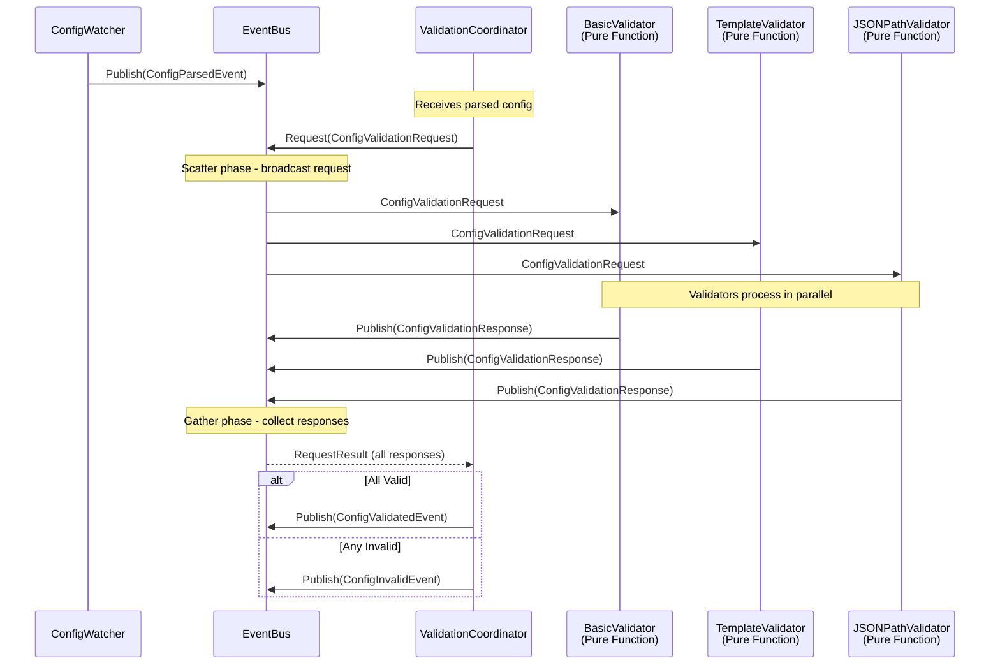

**Pure Packages + Event Adapters**:

All business logic packages remain event-agnostic. Only the `controller` package contains event adapters:

```
pkg/templating/
  validator.go         # Pure: ValidateTemplates(templates map[string]string) []error

pkg/k8s/indexer/
  validator.go         # Pure: ValidateJSONPath(expr string) error

pkg/core/config/
  validator.go         # Pure: ValidateStructure(cfg Config) error  // OK - same package

pkg/controller/validators/    # Event adapters (glue layer)
  template_validator.go      # Adapter: extracts primitives → templating.ValidateTemplates() → events
  jsonpath_validator.go      # Adapter: extracts strings → indexer.ValidateJSONPath() → events
  basic_validator.go         # Adapter: events → config.ValidateStructure() → events
  coordinator.go             # Uses scatter-gather to coordinate validators
```

**Pure Function Example**:

```go
// pkg/templating/validator.go - Zero dependencies on other packages
package templating

// ValidateTemplates validates a map of template names to their content.
// Accepts only primitive types - no dependency on config package.
func ValidateTemplates(templates map[string]string) []error {
    var errors []error
    engine, err := NewTemplateEngine(EngineTypeGonja)
    if err != nil {
        return []error{err}
    }

    for name, content := range templates {
        if err := engine.CompileTemplate(name, content); err != nil {
            errors = append(errors, fmt.Errorf("template %s: %w", name, err))
        }
    }

    return errors
}
```

**Event Adapter Example**:

```go
// pkg/controller/validators/template_validator.go - Event adapter
package validators

import (
    "github.com/yourorg/haproxy-template-ic/pkg/core/config"
    "github.com/yourorg/haproxy-template-ic/pkg/events"
    "github.com/yourorg/haproxy-template-ic/pkg/templating"
)

type TemplateValidatorComponent struct {
    eventBus *events.EventBus
}

func (c *TemplateValidatorComponent) Run(ctx context.Context) error {
    eventChan := c.eventBus.Subscribe(100)

    for {
        select {
        case event := <-eventChan:
            if req, ok := event.(events.ConfigValidationRequest); ok {
                // Controller package knows about config structure
                cfg := req.Config.(config.Config)

                // Extract templates into map[string]string (primitive types only)
                // This is the controller's job - converting between package types
                templates := make(map[string]string)
                templates["haproxy.cfg"] = cfg.HAProxyConfig.Template
                for name, snippet := range cfg.TemplateSnippets {
                    templates[name] = snippet.Template
                }
                for name, mapDef := range cfg.Maps {
                    templates["map:"+name] = mapDef.Template
                }
                for name, file := range cfg.Files {
                    templates["file:"+name] = file.Template
                }

                // Call pure function with primitives only (no config package dependency)
                errs := templating.ValidateTemplates(templates)

                // Convert to event response
                errStrings := make([]string, len(errs))
                for i, e := range errs {
                    errStrings[i] = e.Error()
                }

                // Publish response event
                c.eventBus.Publish(events.NewConfigValidationResponse(
                    req.RequestID(),
                    "template",
                    len(errs) == 0,
                    errStrings,
                ))
            }

        case <-ctx.Done():
            return ctx.Err()
        }
    }
}
```

**Validation Coordinator with Scatter-Gather**:

```go
// pkg/controller/validators/coordinator.go
package validators

type ValidationCoordinator struct {
    eventBus *events.EventBus
}

func (v *ValidationCoordinator) Run(ctx context.Context) error {
    eventChan := v.eventBus.Subscribe(100)

    for {
        select {
        case event := <-eventChan:
            if parsed, ok := event.(events.ConfigParsedEvent); ok {
                // Create validation request
                req := events.NewConfigValidationRequest(parsed.Config, parsed.Version)

                // Use scatter-gather to coordinate validators
                result, err := v.eventBus.Request(ctx, req, events.RequestOptions{
                    Timeout:            10 * time.Second,
                    ExpectedResponders: []string{"basic", "template", "jsonpath"},
                })

                if err != nil || len(result.Errors) > 0 {
                    // Validation failed or timeout
                    errorMap := make(map[string][]string)

                    for _, resp := range result.Responses {
                        if validResp, ok := resp.(events.ConfigValidationResponse); ok && !validResp.Valid {
                            errorMap[validResp.ValidatorName] = validResp.Errors
                        }
                    }

                    for _, errMsg := range result.Errors {
                        errorMap["timeout"] = append(errorMap["timeout"], errMsg)
                    }

                    v.eventBus.Publish(events.ConfigInvalidEvent{
                        Version:          parsed.Version,
                        ValidationErrors: errorMap,
                    })
                    continue
                }

                // All validators passed
                v.eventBus.Publish(events.ConfigValidatedEvent{
                    Config:  parsed.Config,
                    Version: parsed.Version,
                })
            }

        case <-ctx.Done():
            return ctx.Err()
        }
    }
}
```

**Validator Logging Improvements**:

The validation coordinator implements enhanced logging to provide visibility into the scatter-gather validation process:

1. **Structured Logging**: Uses `log/slog` with structured fields for queryability
   - Validator names, response counts, validation error counts
   - Duration tracking for performance monitoring
   - Clear distinction between validation failure (expected) and system errors

2. **Appropriate Log Levels**:
   - `warn` level for validation failures (not `error`) - invalid config is an expected condition
   - `info` level for successful validation with validator details
   - `error` level reserved for actual system failures (timeouts, missing validators)

3. **Detailed Error Aggregation**:
   - Groups validation errors by validator name
   - Shows which validators responded and their individual results
   - Provides actionable error messages for config authors

4. **Observability**: Full visibility into validation workflow
   - Which validators participated in validation
   - How long validation took
   - Exactly which aspects of config failed validation

Example log output for validation failure:
```
level=warn msg="configuration validation failed"
  version="abc123"
  validators_responded=["basic","template","jsonpath"]
  validators_failed=["template","jsonpath"]
  error_count=3
  validation_errors={"template":["syntax error at line 5"],"jsonpath":["invalid expression: .foo[bar"]}
```

**Benefits**:

1. **No Manual Timeout Management**: EventBus handles timeout and response correlation
2. **Pure Packages**: Business logic has zero event dependencies
3. **Clean Separation**: Only controller package contains event glue code
4. **Standard Pattern**: Scatter-gather is well-documented in Enterprise Integration Patterns
5. **Flexible**: Can require all responses or gracefully degrade with partial responses
6. **Testable**: Pure functions easily tested without event infrastructure

**Comparison to Alternatives**:

| Approach | Pros | Cons |
|----------|------|------|
| **Scatter-Gather** | Standard pattern, built-in timeout, clean code | Slight overhead vs direct calls |
| **Manual Aggregator** | More control | Complex timeout logic, error-prone |
| **Direct Function Calls** | Simplest, fastest | Creates package dependencies |
| **Channels** | Go-native | No event stream visibility |

**Selected**: Scatter-gather provides the best balance of simplicity, observability, and maintainability.

##### Event Commentator Pattern

**Decision**: Implement a dedicated Event Commentator component that subscribes to all EventBus events and produces domain-aware log messages with contextual insights.

**Problem**: Traditional logging approaches have several limitations:
- Debug log statements clutter business logic code
- Logs lack cross-event context and domain knowledge
- Difficult to correlate related events across the system
- Business logic becomes less readable with extensive logging
- Hard to produce insightful "commentary" without duplicating domain knowledge

**Solution**: The Event Commentator Pattern - a specialized component that acts like a sports commentator for the system:
- Subscribes to all events on the EventBus
- Maintains a ring buffer of recent events for correlation
- Produces rich, domain-aware log messages with contextual insights
- Completely decoupled from business logic (pure components remain clean)
- Lives in the controller package (only layer that knows about events)

**Concept Origins**:

The Event Commentator pattern combines several established patterns:

1. **Domain-Oriented Observability** (Martin Fowler, 2024): The "Domain Probe" pattern where event-based monitors apply deep domain knowledge to produce insights about system behavior
2. **Cross-Cutting Concerns via Events**: Logging as a concern separated from business logic through event-driven architecture
3. **Process Manager Pattern**: State tracking and event correlation from saga patterns, adapted for observability

**Architecture Pattern**:

```
Event Flow with Commentator:

EventBus (50+ event types)
    │
    ├─> Pure Components (business logic, no logging clutter)
    │   ├── ConfigLoader
    │   ├── TemplateRenderer
    │   ├── Validator
    │   └── Deployer
    │
    └─> Event Commentator (observability layer)
        ├── Subscribes to ALL events
        ├── Ring Buffer (last N events for correlation)
        ├── Domain Knowledge (understands relationships)
        └── Rich Logging (insights, not just data dumps)
```

**Implementation**:

```go
// pkg/controller/commentator/commentator.go
package commentator

import (
    "context"
    "log/slog"
    "time"

    "haproxy-template-ic/pkg/events"
)

// EventCommentator subscribes to all events and produces domain-aware log messages
type EventCommentator struct {
    eventBus   *events.EventBus
    logger     *slog.Logger
    ringBuffer *RingBuffer
}

func NewEventCommentator(eventBus *events.EventBus, logger *slog.Logger, bufferSize int) *EventCommentator {
    return &EventCommentator{
        eventBus:   eventBus,
        logger:     logger,
        ringBuffer: NewRingBuffer(bufferSize),
    }
}

func (c *EventCommentator) Run(ctx context.Context) error {
    events := c.eventBus.Subscribe(1000)

    for {
        select {
        case event := <-events:
            c.ringBuffer.Add(event)
            c.commentate(ctx, event)
        case <-ctx.Done():
            return ctx.Err()
        }
    }
}

func (c *EventCommentator) commentate(ctx context.Context, event events.Event) {
    switch e := event.(type) {
    case events.ReconciliationStartedEvent:
        // Apply domain knowledge: Find what triggered this reconciliation
        trigger := c.ringBuffer.FindMostRecent(func(ev events.Event) bool {
            _, isConfig := ev.(events.ConfigValidatedEvent)
            _, isResource := ev.(events.ResourceIndexUpdatedEvent)
            return isConfig || isResource
        })

        var triggerType string
        var debounceMs int64
        if trigger != nil {
            triggerType = trigger.EventType()
            debounceMs = time.Since(trigger.Timestamp()).Milliseconds()
        }

        c.logger.InfoContext(ctx, "Reconciliation started",
            "trigger_event", triggerType,
            "debounce_duration_ms", debounceMs,
            "trigger_source", e.Trigger,
        )

    case events.ValidationCompletedEvent:
        // Count recent validation attempts for insight
        recentValidations := c.ringBuffer.CountRecent(1*time.Minute, func(ev events.Event) bool {
            _, ok := ev.(events.ValidationStartedEvent)
            return ok
        })

        c.logger.InfoContext(ctx, "Configuration validated successfully",
            "endpoints", len(e.Endpoints),
            "warnings", len(e.Warnings),
            "recent_validations", recentValidations,
        )

        if len(e.Warnings) > 0 {
            for _, warning := range e.Warnings {
                c.logger.WarnContext(ctx, "Validation warning",
                    "warning", warning,
                )
            }
        }

    case events.DeploymentCompletedEvent:
        // Correlate with reconciliation start for end-to-end timing
        reconStart := c.ringBuffer.FindMostRecent(func(ev events.Event) bool {
            _, ok := ev.(events.ReconciliationStartedEvent)
            return ok
        })

        var totalDurationMs int64
        if reconStart != nil {
            totalDurationMs = time.Since(reconStart.Timestamp()).Milliseconds()
        }

        successRate := float64(e.Succeeded) / float64(e.Total) * 100

        c.logger.InfoContext(ctx, "Deployment completed",
            "total_instances", e.Total,
            "succeeded", e.Succeeded,
            "failed", e.Failed,
            "success_rate_percent", successRate,
            "total_duration_ms", totalDurationMs,
        )

        if e.Failed > 0 {
            // Look for failed instance events
            failures := c.ringBuffer.FindAll(func(ev events.Event) bool {
                failEv, ok := ev.(events.InstanceDeploymentFailedEvent)
                return ok && failEv.Timestamp().After(reconStart.Timestamp())
            })

            c.logger.ErrorContext(ctx, "Deployment had failures",
                "failed_count", e.Failed,
                "failure_details", failures,
            )
        }

    case events.ConfigInvalidEvent:
        // Apply domain knowledge about configuration validation
        c.logger.ErrorContext(ctx, "Configuration validation failed",
            "version", e.Version,
            "error", e.Error,
        )

        // Suggest what might be wrong based on recent activity
        recentConfigChanges := c.ringBuffer.CountRecent(5*time.Minute, func(ev events.Event) bool {
            _, ok := ev.(events.ConfigParsedEvent)
            return ok
        })

        if recentConfigChanges > 3 {
            c.logger.WarnContext(ctx, "Multiple recent config changes detected - consider reviewing all recent changes",
                "recent_changes_count", recentConfigChanges,
            )
        }

    case events.ResourceIndexUpdatedEvent:
        c.logger.DebugContext(ctx, "Resource index updated",
            "resource_type", e.ResourceType,
            "count", e.Count,
        )

    case events.HAProxyPodsDiscoveredEvent:
        // Domain insight: Significant event worthy of INFO level
        previousDiscovery := c.ringBuffer.FindMostRecent(func(ev events.Event) bool {
            _, ok := ev.(events.HAProxyPodsDiscoveredEvent)
            return ok
        })

        var change string
        if previousDiscovery != nil {
            prevEv := previousDiscovery.(events.HAProxyPodsDiscoveredEvent)
            if len(e.Endpoints) > len(prevEv.Endpoints) {
                change = "scaled_up"
            } else if len(e.Endpoints) < len(prevEv.Endpoints) {
                change = "scaled_down"
            } else {
                change = "endpoints_changed"
            }
        } else {
            change = "initial_discovery"
        }

        c.logger.InfoContext(ctx, "HAProxy pods discovered",
            "endpoint_count", len(e.Endpoints),
            "change_type", change,
        )
    }
}
```

**Ring Buffer for Event Correlation**:

```go
// pkg/controller/commentator/ringbuffer.go
package commentator

import (
    "sync"
    "time"

    "haproxy-template-ic/pkg/events"
)

// EventWithTimestamp wraps an event with its occurrence time
type EventWithTimestamp struct {
    Event     events.Event
    Timestamp time.Time
}

// RingBuffer maintains a circular buffer of recent events for correlation
type RingBuffer struct {
    events []EventWithTimestamp
    size   int
    index  int
    mu     sync.RWMutex
}

func NewRingBuffer(size int) *RingBuffer {
    return &RingBuffer{
        events: make([]EventWithTimestamp, size),
        size:   size,
    }
}

// Add inserts an event into the ring buffer
func (rb *RingBuffer) Add(event events.Event) {
    rb.mu.Lock()
    defer rb.mu.Unlock()

    rb.events[rb.index] = EventWithTimestamp{
        Event:     event,
        Timestamp: time.Now(),
    }
    rb.index = (rb.index + 1) % rb.size
}

// FindMostRecent searches backwards from newest to oldest for an event matching the predicate
func (rb *RingBuffer) FindMostRecent(predicate func(events.Event) bool) *EventWithTimestamp {
    rb.mu.RLock()
    defer rb.mu.RUnlock()

    // Search backwards from most recent
    for i := 0; i < rb.size; i++ {
        idx := (rb.index - 1 - i + rb.size) % rb.size
        evt := rb.events[idx]
        if evt.Event != nil && predicate(evt.Event) {
            return &evt
        }
    }
    return nil
}

// FindAll returns all events matching the predicate (newest first)
func (rb *RingBuffer) FindAll(predicate func(events.Event) bool) []EventWithTimestamp {
    rb.mu.RLock()
    defer rb.mu.RUnlock()

    var matches []EventWithTimestamp
    for i := 0; i < rb.size; i++ {
        idx := (rb.index - 1 - i + rb.size) % rb.size
        evt := rb.events[idx]
        if evt.Event != nil && predicate(evt.Event) {
            matches = append(matches, evt)
        }
    }
    return matches
}

// CountRecent counts events matching predicate within the time window
func (rb *RingBuffer) CountRecent(duration time.Duration, predicate func(events.Event) bool) int {
    rb.mu.RLock()
    defer rb.mu.RUnlock()

    cutoff := time.Now().Add(-duration)
    count := 0

    for i := 0; i < rb.size; i++ {
        idx := (rb.index - 1 - i + rb.size) % rb.size
        evt := rb.events[idx]
        if evt.Event == nil || evt.Timestamp.Before(cutoff) {
            break
        }
        if predicate(evt.Event) {
            count++
        }
    }

    return count
}
```

**Integration**:

```go
// cmd/controller/main.go - Startup integration
func main() {
    // ... create eventBus ...

    // Create logger from pkg/core/logging
    logger := logging.NewLogger(config.Logging.Verbose)

    // Start event commentator early (Stage 1)
    commentator := commentator.NewEventCommentator(eventBus, logger, 100)
    go commentator.Run(ctx)

    // ... start other components ...
}
```

**Benefits**:

1. **Clean Business Logic**: Pure components remain focused on business logic without logging clutter
2. **Rich Context**: Commentator applies domain knowledge to produce insightful messages
3. **Event Correlation**: Ring buffer enables relating events (e.g., "this deployment was triggered by that config change 234ms ago")
4. **Centralized Observability**: Single place to manage logging strategy and message formatting
5. **Extensibility**: Easy to add commentary for new event types without touching business logic
6. **Performance**: Logging is completely asynchronous, no performance impact on business logic
7. **Maintainability**: Domain knowledge about event relationships lives in one place

**Configuration**:

The event commentator can be configured via controller configuration:

```yaml
controller:
  event_commentator:
    enabled: true
    buffer_size: 100  # Number of events to keep for correlation
    log_level: info   # Minimum level for commentator (debug shows all events)
```

**Example Log Output**:

```
INFO  Reconciliation started trigger_event=resource.index.updated debounce_duration_ms=234 trigger_source=ingress
INFO  Configuration validated successfully endpoints=3 warnings=0 recent_validations=1
INFO  Deployment completed total_instances=3 succeeded=3 failed=0 success_rate_percent=100 total_duration_ms=456
DEBUG Resource index updated resource_type=ingresses count=42
INFO  HAProxy pods discovered endpoint_count=3 change_type=initial_discovery
```

Notice how the commentator provides context that would be impossible with traditional logging:
- "triggered by resource.index.updated 234ms ago" (correlation)
- "recent_validations=1" (trend analysis)
- "total_duration_ms=456" (end-to-end timing across multiple events)
- "change_type=initial_discovery" (domain knowledge about pod lifecycle)

**Comparison to Traditional Logging**:

| Aspect | Traditional Logging | Event Commentator |
|--------|---------------------|-------------------|
| **Code Location** | Scattered throughout business logic | Centralized in commentator |
| **Context** | Limited to current function | Full event history via ring buffer |
| **Domain Knowledge** | Duplicated across components | Centralized in one place |
| **Maintainability** | Hard to update log messages | Single location to update |
| **Testability** | Logging clutters unit tests | Pure components easily tested |
| **Performance** | Synchronous, impacts business logic | Fully asynchronous via events |
| **Correlation** | Manual via correlation IDs | Automatic via event relationships |

**Selected**: The Event Commentator pattern provides superior observability while keeping business logic clean and maintaining the architectural principle of event-agnostic pure components.

## User Interface Design

This is a headless controller with no graphical user interface. Interaction occurs through:

1. **ConfigMap**: Primary configuration interface
2. **Kubernetes Resources**: Watched resources (Ingress, Service, etc.)
3. **Metrics Endpoint**: Prometheus metrics on `:9090/metrics`
4. **Health Endpoint**: Liveness/readiness on `:8080/healthz`
5. **Logs**: Structured JSON logs for operational visibility

## Configuration Example

The following example demonstrates a complete controller configuration with all major features:

```yaml
pod_selector:
  match_labels:
    app: haproxy
    component: loadbalancer

# Grouped controller configuration (previously CLI options)
controller:
  healthz_port: 8080
  metrics_port: 9090

logging:
  verbose: 2  # 0=WARNING, 1=INFO, 2=DEBUG

validation:
  dataplane_host: localhost
  dataplane_port: 5555

# Fields to omit from indexed resources (reduces memory usage)
watched_resources_ignore_fields:
  - metadata.managedFields

watched_resources:
  ingresses:
    api_version: networking.k8s.io/v1
    kind: Ingress
    # Enable validation webhook for Ingress resources to prevent faulty configs
    enable_validation_webhook: true
    # Default indexing by namespace and name for standard iteration
    index_by: ["metadata.namespace", "metadata.name"]

  endpoints:
    api_version: discovery.k8s.io/v1
    kind: EndpointSlice
    # Leave validation disabled for critical resources like EndpointSlices
    enable_validation_webhook: false
    # Custom indexing by service name for O(1) service-to-endpoints matching
    index_by: ["metadata.labels['kubernetes.io/service-name']"]

  secrets:
    api_version: v1
    kind: Secret
    # Enable validation for TLS secrets to catch certificate issues early
    enable_validation_webhook: true
    # Index by namespace and type for efficient TLS secret lookup
    index_by: ["metadata.namespace", "type"]

  services:
    api_version: v1
    kind: Service
    enable_validation_webhook: false
    # Index by namespace and app label for cross-resource matching
    index_by: ["metadata.namespace", "metadata.labels['app']"]

template_snippets:
  backend-name:
    name: backend-name
    template: |
      ing_{{ ingress.metadata.namespace }}_{{ ingress.metadata.name }}_{{ path.backend.service.name }}_{{ path.backend.service.port.name | default(path.backend.service.port.number) }}

  path-map-entry:
    name: path-map-entry
    template: |
      {#- Generate map entries for paths matching specified pathTypes #}
      {#- Usage:  where path_types = ["Exact"] or ["Prefix", "ImplementationSpecific"] #}
      
      
      
      {{ rule.host }}{{ path.path }} {{ suffix }}
      
      
      

  validate-ingress:
    name: validate-ingress
    template: |
      {#- Validation snippet for ingress resources #}
      
        
      
      
        
          
            
          
        
      

  backend-servers:
    name: backend-servers
    template: |
      {#- Pre-allocated server pool with auto-expansion #}
        {#- Single place to adjust initial slots #}

      {#- Collect active endpoints #}
      
      
        
          
            
          
        
      

      {#- Calculate required slots using mathematical approach #}
      
      # active count = {{ active_count }}
      
        
        
      
        
      
      
      # max servers = {{ max_servers }}

      {#- Generate all server slots with fixed names #}
      
        
          {#- Active server with real endpoint #}
          
        server SRV_{{ i }} {{ endpoint.address }}:{{ endpoint.port }}
        
          {#- Disabled placeholder server #}
        server SRV_{{ i }} 127.0.0.1:1 disabled
        
      

  ingress-backends:
    name: ingress-backends
    template: |
      {#- Generate all backend definitions from ingress resources #}
      {#- Usage:  #}
      
      
      
      
      
      
      
      
      
      backend 
        balance roundrobin
        option httpchk GET {{ path.path | default('/') }}
        default-server check
        
      
      
      
      
      
      

maps:
  host.map:
    template: |
      
      
      
      {{ host_without_asterisk }} {{ host_without_asterisk }}
      
      

  path-exact.map:
    template: |
      # This map is used to match the host header (without ":port") concatenated with the requested path (without query params) to an HAProxy backend defined in haproxy.cfg.
      # It should be used with the equality string matcher. Example:
      #   http-request set-var(txn.path_match) var(txn.host_match),concat(,txn.path,),map(/etc/haproxy/maps/path-exact.map)
      
      
      

  path-prefix-exact.map:
    template: |
      # This map is used to match the host header (without ":port") concatenated with the requested path (without query params) to an HAProxy backend defined in haproxy.cfg.
      
      
      

  path-prefix.map:
    template: |
      # This map is used to match the host header (without ":port") concatenated with the requested path (without query params) to an HAProxy backend defined in haproxy.cfg.
      # It should be used with the prefix string matcher. Example:
      #   http-request set-var(txn.path_match) var(txn.host_match),concat(,txn.path,),map_beg(/etc/haproxy/maps/path-prefix.map)
      
      
      

files:
  400.http:
    template: |
      HTTP/1.0 400 Bad Request
      Cache-Control: no-cache
      Connection: close
      Content-Type: text/html

      <html><body><h1>400 Bad Request</h1>
      <p>Your browser sent a request that this server could not understand.</p>
      </body></html>

  403.http:
    template: |
      HTTP/1.0 403 Forbidden
      Cache-Control: no-cache
      Connection: close
      Content-Type: text/html

      <html><body><h1>403 Forbidden</h1>
      <p>You don't have permission to access this resource.</p>
      </body></html>

  408.http:
    template: |
      HTTP/1.0 408 Request Time-out
      Cache-Control: no-cache
      Connection: close
      Content-Type: text/html

      <html><body><h1>408 Request Time-out</h1>
      <p>Your browser didn't send a complete request in time.</p>
      </body></html>

  500.http:
    template: |
      HTTP/1.0 500 Internal Server Error
      Cache-Control: no-cache
      Connection: close
      Content-Type: text/html

      <html><body><h1>500 Internal Server Error</h1>
      <p>An internal server error occurred.</p>
      </body></html>

  502.http:
    template: |
      HTTP/1.0 502 Bad Gateway
      Cache-Control: no-cache
      Connection: close
      Content-Type: text/html

      <html><body><h1>502 Bad Gateway</h1>
      <p>The server received an invalid response from an upstream server.</p>
      </body></html>

  503.http:
    template: |
      HTTP/1.0 503 Service Unavailable
      Cache-Control: no-cache
      Connection: close
      Content-Type: text/html

      <html><body><h1>503 Service Unavailable</h1>
      <p>No server is available to handle this request.</p>
      </body></html>

  504.http:
    template: |
      HTTP/1.0 504 Gateway Time-out
      Cache-Control: no-cache
      Connection: close
      Content-Type: text/html

      <html><body><h1>504 Gateway Time-out</h1>
      <p>The server didn't respond in time.</p>
      </body></html>

haproxy_config:
  template: |
    global
      log stdout len 4096 local0 info
      chroot /var/lib/haproxy
      user haproxy
      group haproxy
      daemon
      ca-base /etc/ssl/certs
      crt-base /etc/haproxy/certs
      tune.ssl.default-dh-param 2048

    defaults
      mode http
      log global
      option httplog
      option dontlognull
      option log-health-checks
      option forwardfor
      option httpchk GET /
      timeout connect 5000
      timeout client 50000
      timeout server 50000
      errorfile 400 {{ "400.http" | get_path("file") }}
      errorfile 403 {{ "403.http" | get_path("file") }}
      errorfile 408 {{ "408.http" | get_path("file") }}
      errorfile 500 {{ "500.http" | get_path("file") }}
      errorfile 502 {{ "502.http" | get_path("file") }}
      errorfile 503 {{ "503.http" | get_path("file") }}
      errorfile 504 {{ "504.http" | get_path("file") }}

    frontend status
      bind *:8404
      no log
      http-request return status 200 content-type text/plain string "OK" if { path /healthz }
      http-request return status 200 content-type text/plain string "READY" if { path /ready }

    frontend http_frontend
      bind *:80

      # Set a few variables
      http-request set-var(txn.base) base
      http-request set-var(txn.path) path
      http-request set-var(txn.host) req.hdr(Host),field(1,:),lower
      http-request set-var(txn.host_match) var(txn.host),map(/etc/haproxy/maps/host.map)
      http-request set-var(txn.host_match) var(txn.host),regsub(^[^.]*,,),map(/etc/haproxy/maps/host.map,'') if !{ var(txn.host_match) -m found }
      http-request set-var(txn.path_match) var(txn.host_match),concat(,txn.path,),map(/etc/haproxy/maps/path-exact.map)
      http-request set-var(txn.path_match) var(txn.host_match),concat(,txn.path,),map(/etc/haproxy/maps/path-prefix-exact.map) if !{ var(txn.path_match) -m found }
      http-request set-var(txn.path_match) var(txn.host_match),concat(,txn.path,),map_beg(/etc/haproxy/maps/path-prefix.map) if !{ var(txn.path_match) -m found }

      # Use path maps for routing
      use_backend %[var(txn.path_match)]

      # Default backend
      default_backend default_backend

    

    backend default_backend
        http-request return status 404
```

**Configuration Highlights**:

1. **Pod Selector**: Identifies HAProxy pods using `app: haproxy` and `component: loadbalancer` labels

2. **Watched Resources**: Four resource types with strategic indexing:
   - **Ingresses**: Indexed by namespace and name for iteration, validation webhook enabled
   - **EndpointSlices**: Indexed by service name for O(1) endpoint lookup
   - **Secrets**: Indexed by namespace and type for TLS certificate management
   - **Services**: Indexed by namespace and app label for cross-resource matching

3. **Template Snippets**: Reusable template components:
   - **backend-name**: Generates consistent backend names from ingress metadata
   - **path-map-entry**: Creates map entries for different path types
   - **validate-ingress**: Validates ingress resources during rendering
   - **backend-servers**: Dynamic server pool with auto-expansion (powers-of-two scaling)
   - **ingress-backends**: Generates complete backend definitions from ingresses

4. **Maps**: Three routing maps for different match types:
   - **host.map**: Host-based routing with wildcard support
   - **path-exact.map**: Exact path matching
   - **path-prefix.map**: Prefix-based path matching

5. **Files**: HTTP error response pages (400, 403, 408, 500, 502, 503, 504)

6. **HAProxy Configuration**: Complete configuration with:
   - Global settings and defaults
   - Status frontend for health checks
   - HTTP frontend with advanced routing using maps
   - Dynamic backend generation via template inclusion

This configuration demonstrates production-ready patterns including resource indexing optimization, validation webhooks for critical resources, and dynamic backend scaling.

## Appendices and References

#### Definitions and Abbreviations

- **API**: Application Programming Interface
- **CRD**: Custom Resource Definition - Kubernetes extension mechanism
- **Dataplane API**: HAProxy's management interface for runtime configuration
- **GVR**: GroupVersionResource - Kubernetes resource identifier
- **HAProxy**: High Availability Proxy - Load balancer and reverse proxy
- **IC**: Ingress Controller
- **Informer**: Kubernetes client-go pattern for watching and caching resources
- **O(1)**: Constant time complexity - performance independent of input size
- **Runtime API**: HAProxy's socket-based interface for zero-reload updates
- **SharedInformerFactory**: client-go factory for creating resource watchers with shared caches

#### References

1. **HAProxy Documentation**
   - Configuration Manual: https://www.haproxy.com/documentation/haproxy-configuration-manual/latest/
   - Dataplane API: https://www.haproxy.com/documentation/haproxy-data-plane-api/
   - Runtime API: https://www.haproxy.com/documentation/haproxy-runtime-api/

2. **HAProxy Go Libraries**
   - client-native: https://github.com/haproxytech/client-native
     - Configuration parser and validator
     - Used for syntax validation without running HAProxy
   - dataplaneapi: https://github.com/haproxytech/dataplaneapi
     - Reference implementation for validation strategies
     - Configuration management patterns

3. **Kubernetes Client Libraries**
   - client-go: https://github.com/kubernetes/client-go
     - Official Kubernetes Go client
     - Informer pattern documentation
   - apimachinery: https://github.com/kubernetes/apimachinery
     - Common machinery for Kubernetes API interactions

4. **Template Engines**
   - gonja v2: https://github.com/nikolalohinski/gonja
     - Pure Go Jinja2 template engine, actively maintained
     - Latest release: v2.4.1 (January 2025)
     - Recommended for Jinja2-compatible templating

5. **Observability**
   - Prometheus client_golang: https://github.com/prometheus/client_golang
   - OpenTelemetry Go: https://github.com/open-telemetry/opentelemetry-go

6. **Design Patterns**
   - Kubernetes Operator Pattern: https://kubernetes.io/docs/concepts/extend-kubernetes/operator/
   - Controller Pattern: https://kubernetes.io/docs/concepts/architecture/controller/

