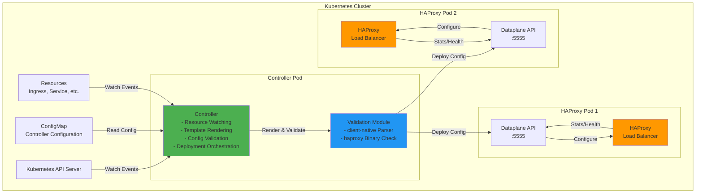
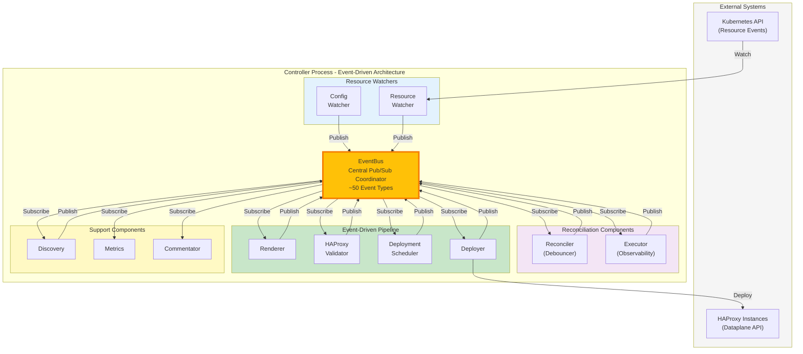
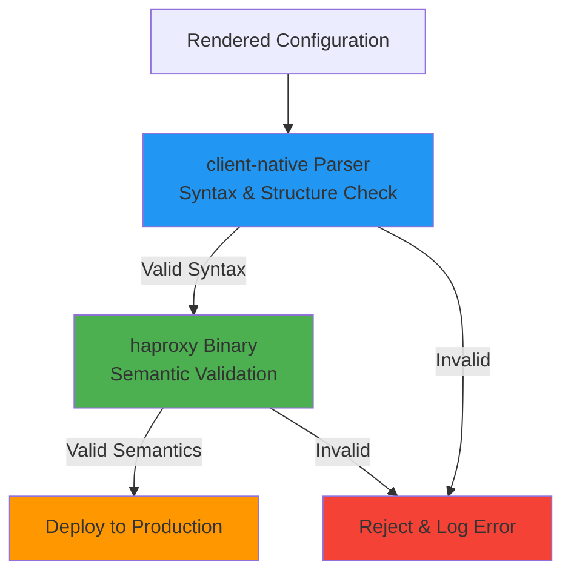

# Architecture Overview

## Overview

The haproxy-template-ingress-controller is a Kubernetes operator that manages HAProxy load balancer configurations through template-driven configuration generation. The system continuously monitors Kubernetes resources and translates them into HAProxy configuration files using a powerful templating engine.

**Core Capabilities:**

- **Template-Driven Configuration**: Uses a feature-rich template engine to generate HAProxy configurations from Kubernetes resources
- **Dynamic Resource Watching**: Monitors user-defined Kubernetes resource types (Ingress, Service, ConfigMap, custom CRDs)
- **Validation-First Deployment**: All configurations are parsed and validated before deployment to production instances
- **Zero-Reload Optimization**: Leverages HAProxy Runtime API for configuration changes that don't require process reloads
- **Structured Comparison**: Intelligently compares configurations to minimize deployments and maximize use of runtime operations

**Operational Model:**

The controller operates through event-driven coordination where components communicate exclusively via EventBus pub/sub:

1. **Resource Watchers** monitor Kubernetes resources and publish change events to EventBus
2. **Reconciler** subscribes to change events, debounces rapid changes, and publishes reconciliation trigger events
3. **Renderer** subscribes to reconciliation trigger events, queries indexed resources from k8s stores, renders templates using pkg/templating, and publishes rendered configuration events
4. **HAProxyValidator** subscribes to rendered configuration events, performs two-phase validation (client-native parser + haproxy binary via pkg/dataplane), and publishes validation result events
5. **DeploymentScheduler** subscribes to validation events, enforces rate limiting, queues deployments if needed, and publishes deployment scheduled events
6. **Deployer** subscribes to deployment scheduled events, executes parallel deployments to all HAProxy endpoints using pkg/dataplane, and publishes deployment completion events
7. **Executor** subscribes to key lifecycle events for observability and publishes reconciliation completion events
8. **EventBus** coordinates all component interactions - no direct component-to-component function calls
9. All components publish completion/failure events for metrics, logging, and further coordination

**Key Design Principles:**

- **Fail-Safe**: Invalid configurations are rejected before reaching production
- **Performance**: Debouncing prevents rapid successive renders, indexing enables fast lookups
- **Observability**: Comprehensive metrics (Prometheus) and distributed tracing (OpenTelemetry)
- **Flexibility**: Templates provide complete control over HAProxy configuration, no annotation limitations

## Component Diagrams

### High-Level System Components

**Component Descriptions:**

- **Controller**: Main controller process that watches Kubernetes resources, renders templates, and orchestrates configuration deployment
- **Validation Module**: Integrated validation using haproxytech/client-native library for parsing and haproxy binary for configuration checks
- **Dataplane API**: HAProxy's management interface for receiving configuration updates and performing runtime operations
- **HAProxy**: Production load balancer instances that serve traffic

### Controller Internal Architecture

**Event-Driven Data Flow:**

1. **Config/Resource Watchers** receive Kubernetes changes and publish events to EventBus
2. **Reconciler** subscribes to change events, debounces rapid changes (default 500ms), filters initial sync events, and publishes ReconciliationTriggeredEvent
3. **Renderer** subscribes to ReconciliationTriggeredEvent, queries k8s stores for resources, renders templates via pkg/templating pure library, publishes TemplateRenderedEvent
4. **HAProxyValidator** subscribes to TemplateRenderedEvent, validates using pkg/dataplane pure validation functions (syntax + semantics), publishes ValidationCompletedEvent or ValidationFailedEvent
5. **DeploymentScheduler** subscribes to ValidationCompletedEvent and HAProxyPodsDiscoveredEvent, enforces rate limiting (default 2s minimum interval), implements "latest wins" queueing, publishes DeploymentScheduledEvent
6. **Deployer** subscribes to DeploymentScheduledEvent, executes parallel deployments to all HAProxy endpoints using pkg/dataplane client, publishes InstanceDeployedEvent and DeploymentCompletedEvent
7. **Executor** subscribes to key lifecycle events for observability, publishes ReconciliationStartedEvent and ReconciliationCompletedEvent with duration metrics
8. **Support Components** (Discovery, Metrics, Commentator) subscribe to relevant events for their specific purposes
9. All components publish completion/failure events that flow back through EventBus for metrics, logging, and coordination

**Key Architecture Properties:**

- **EventBus** is the single coordination mechanism - zero direct component-to-component function calls
- **Event-Driven Components** (Renderer, Validator, Scheduler, Deployer) are wrappers around pure libraries (pkg/templating, pkg/dataplane, pkg/k8s)
- **Pure Libraries** (pkg/templating, pkg/dataplane, pkg/k8s) contain testable business logic with no event dependencies
- **Event Adapters** translate between EventBus pub/sub and pure library function calls
- **Extensibility** - new features can subscribe to existing events without modifying existing code
- **Independent Testing** - pure libraries can be unit tested, event adapters can be integration tested

### Validation Flow

**Validation Strategy:**

The two-phase validation eliminates the need for a separate validation sidecar container:

1. **Phase 1 - Syntax Parsing**: client-native library parses configuration structure and validates against HAProxy config grammar
2. **Phase 2 - Semantic Validation**: haproxy binary (`haproxy -c -f config`) performs full semantic validation including resource availability checks. Writes auxiliary files to actual HAProxy directories (with mutex locking) to match Dataplane API validation behavior exactly.

This approach provides the same validation guarantees as running a full HAProxy instance while being more lightweight and faster.
