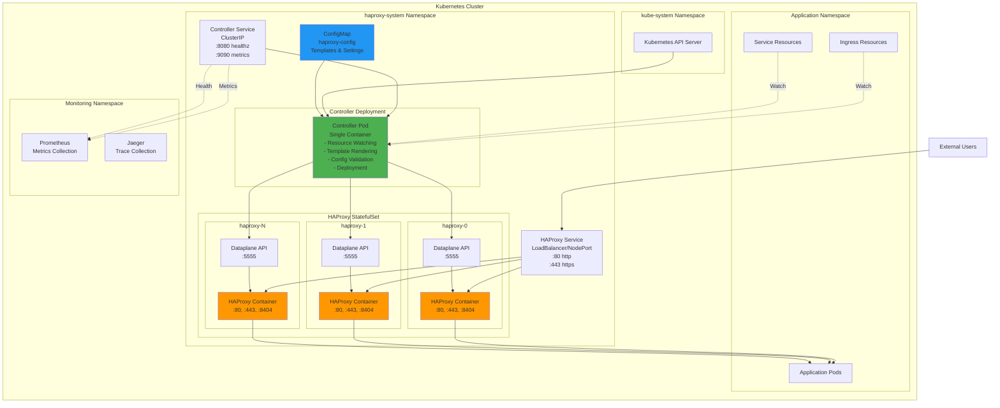
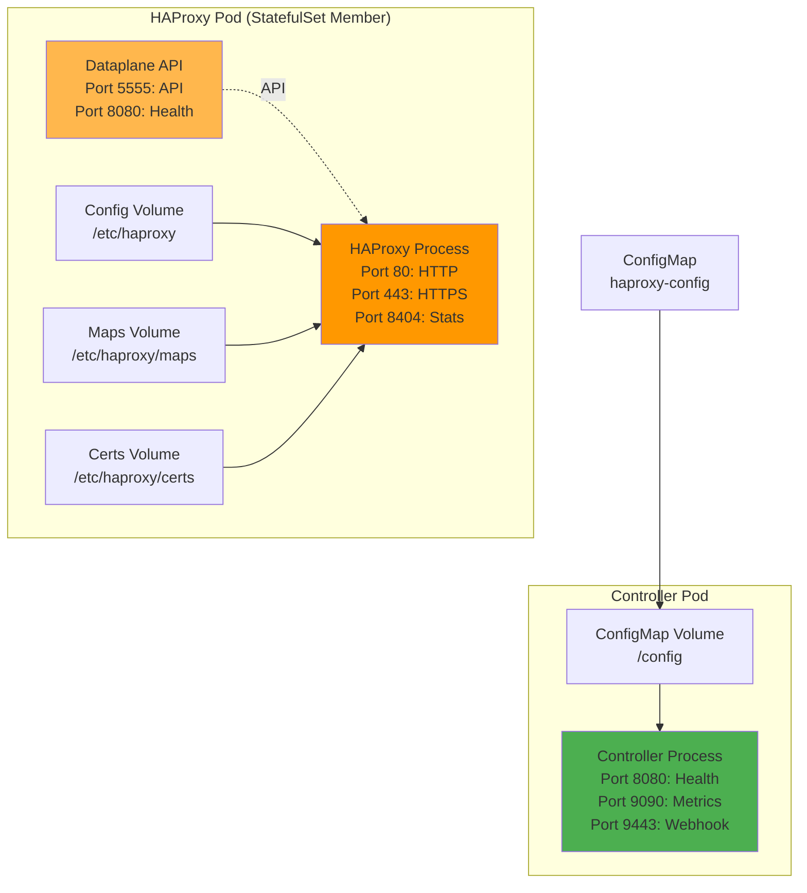
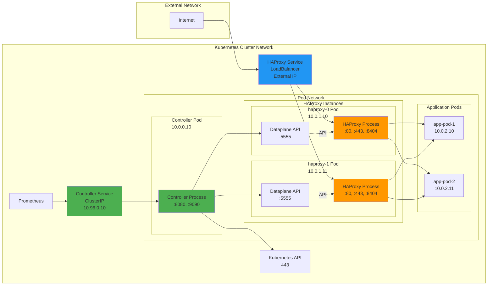

# Deployment Diagrams

## Kubernetes Deployment Architecture

**Deployment Components:**

1. **Controller Deployment**: Single replica deployment running the operator
   - Watches Kubernetes resources cluster-wide
   - Renders templates and validates configurations
   - Deploys to HAProxy instances via Dataplane API
   - Exposes metrics and health endpoints via Controller Service

2. **Controller Service**: ClusterIP service for operational endpoints
   - Port 8080: Health checks (liveness/readiness probes)
   - Port 9090: Prometheus metrics
   - Internal use only (not exposed externally)

3. **HAProxy StatefulSet**: Multiple replicas for high availability
   - Each pod runs HAProxy + Dataplane API sidecar
   - Service selector targets HAProxy pods for traffic routing
   - Scales horizontally based on load

4. **HAProxy Service**: LoadBalancer/NodePort service for ingress traffic
   - Port 80: HTTP traffic routing
   - Port 443: HTTPS/TLS traffic routing
   - Exposes HAProxy pods externally for user traffic

5. **ConfigMap**: Contains controller configuration
   - Template definitions (haproxy.cfg, maps, certificates)
   - Watched resource types and indexing configuration
   - Rendering and deployment settings

## Container Architecture

**Resource Requirements:**

Controller Pod:
- CPU: 100m request, 500m limit
- Memory: 128Mi request, 512Mi limit
- Volumes: ConfigMap mount for configuration

HAProxy Pod:
- HAProxy Container: 200m CPU, 256Mi memory (per instance)
- Dataplane API Container: 100m CPU, 128Mi memory
- Volumes: EmptyDir for dynamic configs, maps, and certificates

## Network Topology

**Network Flow:**

1. **Ingress Traffic**: Internet → HAProxy Service (LoadBalancer) → HAProxy Pods → Application Pods
2. **Control Plane**: Controller → Kubernetes API (resource watching)
3. **Configuration Deployment**: Controller → Dataplane API endpoints (HTTP)
4. **Service Discovery**: Controller watches HAProxy pods via Kubernetes API
5. **Monitoring**: Prometheus → Controller Service (ClusterIP) → Controller Pod (metrics endpoint)
6. **Health Checks**: Kubernetes → Controller Service → Controller Pod (healthz endpoint)

**Scaling Considerations:**

- **Horizontal Scaling**: Increase HAProxy StatefulSet replicas for more capacity
- **Controller Scaling**: Single active controller (leader election for HA in future)
- **Resource Limits**: Adjust based on number of watched resources and template complexity
- **Network**: Ensure LoadBalancer can distribute traffic across all HAProxy replicas
