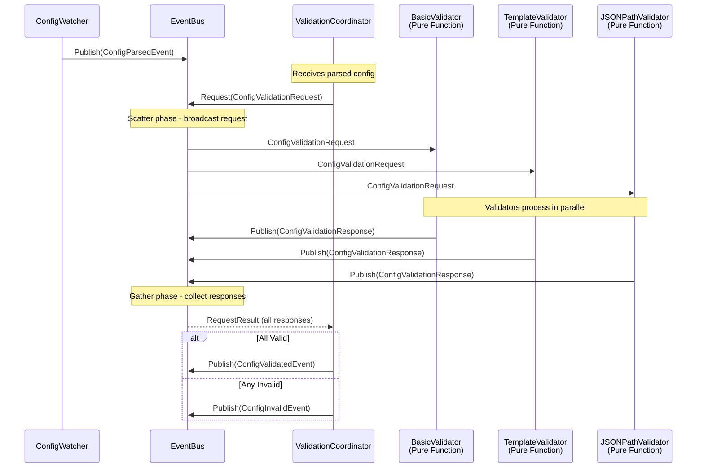

#### Key Design Decisions

##### Configuration Validation Strategy

**Decision**: Use two-phase validation (client-native parser + haproxy binary) instead of running a full validation sidecar.

**Rationale**:
- **Performance**: Parser validation is fast (~10ms), binary validation completes in ~50-100ms
- **Resource Efficiency**: No additional HAProxy container needed (saves ~256Mi memory per controller pod)
- **Simplicity**: Single container deployment reduces complexity
- **Reliability**: Same validation guarantees as full HAProxy instance

**Implementation**:
```go
// Validation is implemented in pkg/dataplane/validator.go
// Uses real HAProxy directories with mutex locking to match Dataplane API behavior

// ValidationPaths holds filesystem paths for validation
type ValidationPaths struct {
    MapsDir           string  // e.g., /etc/haproxy/maps
    SSLCertsDir       string  // e.g., /etc/haproxy/certs
    GeneralStorageDir string  // e.g., /etc/haproxy/general
    ConfigFile        string  // e.g., /etc/haproxy/haproxy.cfg
}

func ValidateConfiguration(mainConfig string, auxFiles *AuxiliaryFiles, paths ValidationPaths) error {
    // Acquire mutex to ensure only one validation at a time
    validationMutex.Lock()
    defer validationMutex.Unlock()

    // Phase 1: Syntax validation with client-native parser
    if err := validateSyntax(mainConfig); err != nil {
        return &ValidationError{Phase: "syntax", Err: err}
    }

    // Phase 2: Semantic validation with haproxy binary
    // Writes files to real HAProxy directories, then runs haproxy -c
    if err := validateSemantics(mainConfig, auxFiles, paths); err != nil {
        return &ValidationError{Phase: "semantic", Err: err}
    }

    return nil
}
```

**Validation Paths Configuration**:

The validation paths must match the HAProxy Dataplane API server's resource configuration. These are configured via the controller's ConfigMap:

```yaml
validation:
  maps_dir: /etc/haproxy/maps
  ssl_certs_dir: /etc/haproxy/certs
  general_storage_dir: /etc/haproxy/general
  config_file: /etc/haproxy/haproxy.cfg
```

The validator uses mutex locking to ensure only one validation runs at a time, preventing concurrent writes to the HAProxy directories. This approach exactly matches how the Dataplane API performs validation.

**Parser Improvements**:

The config parser (`pkg/dataplane/parser`) has been enhanced to correctly handle all HAProxy global directives:

1. **Fixed Log Target Parsing**: Previously, the parser incorrectly treated `log-send-hostname` as a log target
   - Now correctly identifies log targets: lines starting with "log" followed by an address
   - Properly classifies `log-send-hostname` as a general global directive (not a log target)
   - Example valid config now parses correctly:
     ```
     global
         log stdout local0
         log-send-hostname
     ```

2. **Improved Directive Classification**: Enhanced logic to distinguish between:
   - Log targets: `log <address> <facility> [level]`
   - Log options: `log-send-hostname`, `log-tag`, etc.
   - Other global directives

3. **Better Error Messages**: Parser now provides clearer error messages when encountering unsupported directives

This fix resolves issues where valid HAProxy configurations were rejected during the parsing phase of validation.

##### Template Engine Selection

**Decision**: Use a Jinja2-like template engine for Go with rich feature set.

**Candidates Evaluated**:
1. **gonja v2**: Pure Go Jinja2 implementation, actively maintained (v2.4.1, January 2025)
2. **pongo2**: Django/Jinja2 syntax, comprehensive but last release 2022
3. **text/template**: Go stdlib, limited features, verbose syntax
4. **jet**: Fast, but different syntax paradigm

**Selected**: gonja v2 (github.com/nikolalohinski/gonja/v2)

**Rationale**:
- **Active Maintenance**: Latest release v2.4.1 (January 2025), ongoing development
- **Jinja2 Compatibility**: Aims for maximum compatibility with Python's Jinja2 engine
- **Familiarity**: Jinja2 syntax is well-known in operations community
- **Features**: Full feature set including filters, macros, template inheritance, control flow
- **Extensibility**: Easy to add custom filters (b64decode, get_path, etc.)
- **Pure Go**: No external dependencies, requires Go 1.21+

##### Kubernetes Client Architecture

**Decision**: Use client-go with SharedInformerFactory for resource watching, no heavy controller framework.

**Rationale**:
- **Control**: Direct control over informer lifecycle and event handling
- **Flexibility**: Custom indexing logic without framework constraints
- **Performance**: Optimized cache and index management
- **Simplicity**: No code generation, no framework-imposed structure

**Implementation Pattern**:
```go
// Slim approach using client-go
factory := informers.NewSharedInformerFactory(clientset, resyncPeriod)

// Add informers for each watched resource type
for _, resource := range config.WatchedResources {
    gvr := schema.GroupVersionResource{...}
    informer := factory.ForResource(gvr)

    informer.Informer().AddEventHandler(cache.ResourceEventHandlerFuncs{
        AddFunc:    handleAdd,
        UpdateFunc: handleUpdate,
        DeleteFunc: handleDelete,
    })
}

factory.Start(stopCh)
```

##### Concurrency Model

**Decision**: Use Go routines and channels for async operations with structured concurrency.

**Key Patterns**:

1. **Event Processing**: Buffered channels for event debouncing
   ```go
   type Debouncer struct {
       events chan Event
       timer  *time.Timer
   }
   ```

2. **Parallel Deployment**: Worker pools for deploying to multiple HAProxy instances
   ```go
   var wg sync.WaitGroup
   for _, endpoint := range endpoints {
       wg.Add(1)
       go func(ep DataplaneEndpoint) {
           defer wg.Done()
           deploy(ep)
       }(endpoint)
   }
   wg.Wait()
   ```

3. **Context Propagation**: All operations use context.Context for cancellation
   ```go
   func (s *Synchronizer) Deploy(ctx context.Context, config Config) error {
       ctx, cancel := context.WithTimeout(ctx, 30*time.Second)
       defer cancel()
       // ... deployment logic
   }
   ```

##### Observability Integration

**Decision**: Prometheus metrics + OpenTelemetry tracing with standardized naming.

**Metrics Implementation**:

The controller implements comprehensive Prometheus metrics through the event adapter pattern:

**Architecture**:
- `pkg/metrics`: Generic metrics infrastructure with instance-based registry
- `pkg/controller/metrics`: Event adapter subscribing to controller lifecycle events
- Metrics exposed on configurable port (default 9090) at `/metrics` endpoint

**Implementation**:
```go
// Instance-based registry (not global)
metricsRegistry := prometheus.NewRegistry()

// Create metrics component
metricsComponent := metrics.NewMetricsComponent(eventBus, metricsRegistry)

// Start metrics collection (after EventBus.Start())
go metricsComponent.Start(ctx)

// Start HTTP server
metricsServer := pkgmetrics.NewServer(":9090", metricsRegistry)
go metricsServer.Start(ctx)
```

**Metrics Exposed** (11 total):

1. **Reconciliation Metrics**:
   - `haproxy_ic_reconciliation_total`: Counter for reconciliation cycles
   - `haproxy_ic_reconciliation_errors_total`: Counter for reconciliation failures
   - `haproxy_ic_reconciliation_duration_seconds`: Histogram for reconciliation duration

2. **Deployment Metrics**:
   - `haproxy_ic_deployment_total`: Counter for deployments
   - `haproxy_ic_deployment_errors_total`: Counter for deployment failures
   - `haproxy_ic_deployment_duration_seconds`: Histogram for deployment duration

3. **Validation Metrics**:
   - `haproxy_ic_validation_total`: Counter for validations
   - `haproxy_ic_validation_errors_total`: Counter for validation failures

4. **Resource Metrics**:
   - `haproxy_ic_resource_count`: Gauge vector with type labels (haproxy-pods, watched-resources)

5. **Event Bus Metrics**:
   - `haproxy_ic_event_subscribers`: Gauge for active subscribers
   - `haproxy_ic_events_published_total`: Counter for published events

See `pkg/controller/metrics/README.md` for complete metric definitions and Prometheus queries.

**Tracing Integration**:
```go
import "go.opentelemetry.io/otel"

func (r *Renderer) Render(ctx context.Context, tpl string) (string, error) {
    ctx, span := otel.Tracer("haproxy-template-ic").Start(ctx, "render_template")
    defer span.End()

    span.SetAttributes(
        attribute.Int("template_size", len(tpl)),
    )

    // ... rendering logic

    return result, nil
}
```

##### Error Handling Strategy

**Decision**: Structured errors with context using standard library errors package and custom error types.

**Pattern**:
```go
// Custom error types for different failure modes
type ValidationError struct {
    ConfigSize int
    Line       int
    Details    string
    Err        error
}

func (e *ValidationError) Error() string {
    return fmt.Sprintf("validation failed at line %d: %s", e.Line, e.Details)
}

func (e *ValidationError) Unwrap() error {
    return e.Err
}

// Usage with error wrapping
func validate(config string) error {
    if err := parser.Parse(config); err != nil {
        return &ValidationError{
            ConfigSize: len(config),
            Details:    "syntax error",
            Err:        err,
        }
    }
    return nil
}
```

##### Event-Driven Architecture

**Decision**: Implement event-driven architecture for component decoupling and extensibility.

**Rationale**:
- **Decoupling**: Components communicate via events, not direct calls
- **Extensibility**: New features can be added without modifying existing code
- **Observability**: Complete system visibility through event stream
- **Testability**: Pure components without event dependencies
- **Maintainability**: Clear separation between business logic and coordination

**Architecture Pattern**:

The architecture uses a **pure libraries + event-driven components** pattern:

```
Component Architecture:
├── Pure Libraries (business logic, no event dependencies)
│   ├── pkg/templating - Template engine with pre-compilation and rendering
│   ├── pkg/dataplane - HAProxy config validation, parsing, and deployment
│   ├── pkg/k8s - Resource watching, indexing, and storage
│   └── pkg/core - Configuration types and basic validation
│
└── Event-Driven Components (event adapters wrapping pure libraries)
    ├── pkg/controller/renderer - Subscribes to ReconciliationTriggeredEvent, calls pkg/templating
    ├── pkg/controller/validator - Subscribes to TemplateRenderedEvent, calls pkg/dataplane validation
    ├── pkg/controller/deployer - DeploymentScheduler and Deployer components calling pkg/dataplane
    ├── pkg/controller/reconciler - Debounces resource changes and triggers reconciliation
    └── pkg/controller/executor - Observability component tracking reconciliation lifecycle
```

**Key Distinction**:
- **Pure Libraries**: Testable business logic with no EventBus dependencies (pkg/templating, pkg/dataplane, pkg/k8s)
- **Event-Driven Components**: Controllers that subscribe to events, call pure libraries, and publish result events (pkg/controller/*)

**Homegrown Event Bus Implementation**:

```go
// pkg/events/bus.go
package events

import "sync"

// Event interface for type safety and immutability
//
// All event types MUST use pointer receivers for Event interface methods.
// This avoids copying large structs (200+ bytes) and follows Go best practices.
//
// All event types MUST implement both methods:
//   - EventType() returns the unique event type string
//   - Timestamp() returns when the event was created
//
// Events are immutable after creation. Constructor functions perform defensive
// copying of slices and maps to prevent post-publication mutation.
type Event interface {
    EventType() string
    Timestamp() time.Time
}

// EventBus provides pub/sub coordination with startup coordination.
//
// Startup Coordination:
// Events published before Start() is called are buffered and replayed after Start().
// This prevents race conditions during component initialization where events might
// be published before all subscribers have connected.
type EventBus struct {
    subscribers []chan Event
    mu          sync.RWMutex

    // Startup coordination
    started        bool
    startMu        sync.Mutex
    preStartBuffer []Event
}

// NewEventBus creates a new EventBus.
//
// The bus starts in buffering mode - events published before Start() is called
// will be buffered and replayed when Start() is invoked.
//
// The capacity parameter sets the initial buffer size for pre-start events.
// Recommended: 100 for most applications.
func NewEventBus(capacity int) *EventBus {
    return &EventBus{
        subscribers:    make([]chan Event, 0),
        started:        false,
        preStartBuffer: make([]Event, 0, capacity),
    }
}

// Publish sends event to all subscribers.
//
// If Start() has not been called yet, the event is buffered and will be
// replayed when Start() is invoked. After Start() is called, this is a
// non-blocking operation that drops events to lagging subscribers.
//
// Returns the number of subscribers that received the event.
// Returns 0 if event was buffered (before Start()).
func (b *EventBus) Publish(event Event) int {
    // Check if bus has started
    b.startMu.Lock()
    if !b.started {
        // Buffer event for replay after Start()
        b.preStartBuffer = append(b.preStartBuffer, event)
        b.startMu.Unlock()
        return 0
    }
    b.startMu.Unlock()

    // Bus has started - publish to subscribers
    b.mu.RLock()
    defer b.mu.RUnlock()

    sent := 0
    for _, ch := range b.subscribers {
        select {
        case ch <- event:
            sent++
        default:
            // Channel full, subscriber lagging - drop event
        }
    }
    return sent
}

// Subscribe creates new event channel
func (b *EventBus) Subscribe(bufferSize int) <-chan Event {
    b.mu.Lock()
    defer b.mu.Unlock()

    ch := make(chan Event, bufferSize)
    b.subscribers = append(b.subscribers, ch)
    return ch
}

// Start releases all buffered events and switches the bus to normal operation mode.
//
// This method should be called after all components have subscribed to the bus
// during application startup. It ensures that no events are lost during the
// initialization phase.
//
// Behavior:
//  1. Marks the bus as started
//  2. Replays all buffered events to subscribers in order
//  3. Clears the buffer
//  4. All subsequent Publish() calls go directly to subscribers
//
// This method is idempotent - calling it multiple times has no additional effect.
func (b *EventBus) Start() {
    b.startMu.Lock()
    defer b.startMu.Unlock()

    // Idempotent - return if already started
    if b.started {
        return
    }

    // Mark as started (must be done before replaying to avoid recursion)
    b.started = true

    // Replay buffered events to subscribers
    if len(b.preStartBuffer) > 0 {
        b.mu.RLock()
        subscribers := b.subscribers
        b.mu.RUnlock()

        for _, event := range b.preStartBuffer {
            // Publish each buffered event
            for _, ch := range subscribers {
                select {
                case ch <- event:
                    // Event sent
                default:
                    // Channel full - drop event (same behavior as normal Publish)
                }
            }
        }

        // Clear buffer
        b.preStartBuffer = nil
    }
}
```

**Event Type Definitions**:

```go
// pkg/events/types.go
package events

// Event categories covering complete controller lifecycle
//
// All events use pointer receivers and include private timestamp fields.
// Constructor functions (New*Event) perform defensive copying of slices/maps.

// Lifecycle Events
type ControllerStartedEvent struct {
    ConfigVersion  string
    SecretVersion  string
    timestamp      time.Time
}

func NewControllerStartedEvent(configVersion, secretVersion string) *ControllerStartedEvent {
    return &ControllerStartedEvent{
        ConfigVersion: configVersion,
        SecretVersion: secretVersion,
        timestamp:     time.Now(),
    }
}

func (e *ControllerStartedEvent) EventType() string    { return "controller.started" }
func (e *ControllerStartedEvent) Timestamp() time.Time { return e.timestamp }

type ControllerShutdownEvent struct {
    Reason    string
    timestamp time.Time
}

func NewControllerShutdownEvent(reason string) *ControllerShutdownEvent {
    return &ControllerShutdownEvent{
        Reason:    reason,
        timestamp: time.Now(),
    }
}

func (e *ControllerShutdownEvent) EventType() string    { return "controller.shutdown" }
func (e *ControllerShutdownEvent) Timestamp() time.Time { return e.timestamp }

// Configuration Events
type ConfigParsedEvent struct {
    Config        interface{}
    Version       string
    SecretVersion string
    timestamp     time.Time
}

func NewConfigParsedEvent(config interface{}, version, secretVersion string) *ConfigParsedEvent {
    return &ConfigParsedEvent{
        Config:        config,
        Version:       version,
        SecretVersion: secretVersion,
        timestamp:     time.Now(),
    }
}

func (e *ConfigParsedEvent) EventType() string    { return "config.parsed" }
func (e *ConfigParsedEvent) Timestamp() time.Time { return e.timestamp }

type ConfigValidatedEvent struct {
    Config        interface{}
    Version       string
    SecretVersion string
    timestamp     time.Time
}

func NewConfigValidatedEvent(config interface{}, version, secretVersion string) *ConfigValidatedEvent {
    return &ConfigValidatedEvent{
        Config:        config,
        Version:       version,
        SecretVersion: secretVersion,
        timestamp:     time.Now(),
    }
}

func (e *ConfigValidatedEvent) EventType() string    { return "config.validated" }
func (e *ConfigValidatedEvent) Timestamp() time.Time { return e.timestamp }

type ConfigInvalidEvent struct {
    Version          string
    ValidationErrors map[string][]string // validator name -> errors
    timestamp        time.Time
}

// NewConfigInvalidEvent creates a new ConfigInvalidEvent with defensive copying
func NewConfigInvalidEvent(version string, validationErrors map[string][]string) *ConfigInvalidEvent {
    // Defensive copy of map with slice values
    errorsCopy := make(map[string][]string, len(validationErrors))
    for k, v := range validationErrors {
        if len(v) > 0 {
            vCopy := make([]string, len(v))
            copy(vCopy, v)
            errorsCopy[k] = vCopy
        }
    }

    return &ConfigInvalidEvent{
        Version:          version,
        ValidationErrors: errorsCopy,
        timestamp:        time.Now(),
    }
}

func (e *ConfigInvalidEvent) EventType() string    { return "config.invalid" }
func (e *ConfigInvalidEvent) Timestamp() time.Time { return e.timestamp }

// Resource Events
type ResourceIndexUpdatedEvent struct {
    // ResourceTypeName identifies the resource type from config (e.g., "ingresses", "services").
    ResourceTypeName string

    // ChangeStats provides detailed change statistics including Created, Modified, Deleted counts
    // and whether this event occurred during initial sync.
    ChangeStats types.ChangeStats

    timestamp time.Time
}

func NewResourceIndexUpdatedEvent(resourceTypeName string, changeStats types.ChangeStats) *ResourceIndexUpdatedEvent {
    return &ResourceIndexUpdatedEvent{
        ResourceTypeName: resourceTypeName,
        ChangeStats:      changeStats,
        timestamp:        time.Now(),
    }
}

func (e *ResourceIndexUpdatedEvent) EventType() string    { return "resource.index.updated" }
func (e *ResourceIndexUpdatedEvent) Timestamp() time.Time { return e.timestamp }

type ResourceSyncCompleteEvent struct {
    // ResourceTypeName identifies the resource type from config (e.g., "ingresses").
    ResourceTypeName string

    // InitialCount is the number of resources loaded during initial sync.
    InitialCount int

    timestamp time.Time
}

func NewResourceSyncCompleteEvent(resourceTypeName string, initialCount int) *ResourceSyncCompleteEvent {
    return &ResourceSyncCompleteEvent{
        ResourceTypeName: resourceTypeName,
        InitialCount:     initialCount,
        timestamp:        time.Now(),
    }
}

func (e *ResourceSyncCompleteEvent) EventType() string    { return "resource.sync.complete" }
func (e *ResourceSyncCompleteEvent) Timestamp() time.Time { return e.timestamp }

type IndexSynchronizedEvent struct {
    // ResourceCounts maps resource types to their counts.
    ResourceCounts map[string]int
    timestamp      time.Time
}

// NewIndexSynchronizedEvent creates a new IndexSynchronizedEvent with defensive copying
func NewIndexSynchronizedEvent(resourceCounts map[string]int) *IndexSynchronizedEvent {
    // Defensive copy of map
    countsCopy := make(map[string]int, len(resourceCounts))
    for k, v := range resourceCounts {
        countsCopy[k] = v
    }

    return &IndexSynchronizedEvent{
        ResourceCounts: countsCopy,
        timestamp:      time.Now(),
    }
}

func (e *IndexSynchronizedEvent) EventType() string    { return "index.synchronized" }
func (e *IndexSynchronizedEvent) Timestamp() time.Time { return e.timestamp }

// Reconciliation Events
type ReconciliationTriggeredEvent struct {
    Reason    string
    timestamp time.Time
}

func NewReconciliationTriggeredEvent(reason string) *ReconciliationTriggeredEvent {
    return &ReconciliationTriggeredEvent{
        Reason:    reason,
        timestamp: time.Now(),
    }
}

func (e *ReconciliationTriggeredEvent) EventType() string    { return "reconciliation.triggered" }
func (e *ReconciliationTriggeredEvent) Timestamp() time.Time { return e.timestamp }

type ReconciliationStartedEvent struct {
    Trigger   string
    timestamp time.Time
}

func NewReconciliationStartedEvent(trigger string) *ReconciliationStartedEvent {
    return &ReconciliationStartedEvent{
        Trigger:   trigger,
        timestamp: time.Now(),
    }
}

func (e *ReconciliationStartedEvent) EventType() string    { return "reconciliation.started" }
func (e *ReconciliationStartedEvent) Timestamp() time.Time { return e.timestamp }

type ReconciliationCompletedEvent struct {
    DurationMs int64
    timestamp  time.Time
}

func NewReconciliationCompletedEvent(durationMs int64) *ReconciliationCompletedEvent {
    return &ReconciliationCompletedEvent{
        DurationMs: durationMs,
        timestamp:  time.Now(),
    }
}

func (e *ReconciliationCompletedEvent) EventType() string    { return "reconciliation.completed" }
func (e *ReconciliationCompletedEvent) Timestamp() time.Time { return e.timestamp }

type ReconciliationFailedEvent struct {
    Error     string
    timestamp time.Time
}

func NewReconciliationFailedEvent(err string) *ReconciliationFailedEvent {
    return &ReconciliationFailedEvent{
        Error:     err,
        timestamp: time.Now(),
    }
}

func (e *ReconciliationFailedEvent) EventType() string    { return "reconciliation.failed" }
func (e *ReconciliationFailedEvent) Timestamp() time.Time { return e.timestamp }

// Note: All ~50 event types follow the same pattern:
// - Pointer receivers for EventType() and Timestamp() methods
// - Private timestamp field set in constructor
// - Constructor function (New*Event) that performs defensive copying
// - Exported fields for event data
//
// Additional event categories (not shown for brevity):
// - Template Events (TemplateRenderedEvent, TemplateRenderFailedEvent)
// - Validation Events (ValidationStartedEvent, ValidationCompletedEvent, ValidationFailedEvent)
// - Deployment Events (DeploymentStartedEvent, InstanceDeployedEvent, DeploymentCompletedEvent)
// - Storage Events (StorageSyncStartedEvent, StorageSyncCompletedEvent)
// - HAProxy Discovery Events (HAProxyPodsDiscoveredEvent)
//
// See pkg/controller/events/types.go for complete event catalog.
```

**Event Immutability Contract**:

Events in the system are designed to be immutable after creation, representing historical facts about what happened. The implementation balances practical immutability with Go idioms and performance:

1. **Pointer Receivers**: All Event interface methods use pointer receivers
   - Avoids copying large structs (many events exceed 200 bytes)
   - Follows Go best practices for methods on types with mutable fields
   - Enforced by custom `eventimmutability` linter in `tools/linters/`

2. **Exported Fields**: Event fields are exported for idiomatic Go access
   - Follows industry standards (Kubernetes, NATS)
   - Enables JSON serialization without reflection tricks
   - Relies on team discipline rather than compiler enforcement

3. **Defensive Copying**: Constructors perform defensive copies of slices and maps
   - Publishers cannot modify events after creation
   - Example: `NewConfigInvalidEvent` deep-copies the validation errors map
   - Prevents accidental mutation from affecting published events

4. **Read-Only Discipline**: Consumers must treat events as read-only
   - Enforced through code review and team practices
   - This is an internal project where all consumers are controlled
   - Alternative (unexported fields + getters) would be less idiomatic Go

5. **Custom Linter**: The `eventimmutability` analyzer enforces pointer receivers
   - Integrated into `make lint` and CI pipeline
   - Prevents value receivers that would cause struct copying
   - Located in `tools/linters/eventimmutability/`

This approach provides practical immutability while maintaining clean, idiomatic Go code without the overhead of getters or complex accessor patterns.

**Component with Event Adapter Pattern**:

```go
// pkg/dataplane/client.go - Pure component (no event knowledge)
type DataplaneClient struct {
    endpoints []DataplaneEndpoint
}

func (c *DataplaneClient) DeployConfig(ctx context.Context, config string) error {
    // Pure business logic
    // No event publishing here
    return c.deploy(ctx, config)
}

// pkg/dataplane/adapter.go - Event adapter wrapping pure component
type DataplaneEventAdapter struct {
    client   *DataplaneClient
    eventBus *EventBus
}

func (a *DataplaneEventAdapter) DeployConfig(ctx context.Context, config string) error {
    // Publish start event
    a.eventBus.Publish(DeploymentStartedEvent{
        Endpoints: a.client.endpoints,
    })

    // Call pure component
    err := a.client.DeployConfig(ctx, config)

    // Publish result event
    if err != nil {
        a.eventBus.Publish(DeploymentFailedEvent{Error: err.Error()})
        return err
    }

    a.eventBus.Publish(DeploymentCompletedEvent{
        Total: len(a.client.endpoints),
        Succeeded: len(a.client.endpoints),
        Failed: 0,
    })

    return nil
}
```

**Staged Startup with Event Coordination**:

```go
// cmd/controller/main.go
func main() {
    ctx := context.Background()

    // Create event bus
    eventBus := events.NewEventBus(1000)

    // Stage 1: Config Management Components
    log.Info("Stage 1: Starting config management")

    configWatcher := NewConfigWatcher(client, eventBus)
    configLoader := NewConfigLoader(eventBus)
    configValidator := NewConfigValidator(eventBus)

    go configWatcher.Run(ctx)
    go configLoader.Run(ctx)
    go configValidator.Run(ctx)

    // Start the event bus - ensures all components have subscribed before events flow
    // This prevents race conditions where events are published before subscribers connect
    eventBus.Start()

    // Stage 2: Wait for Valid Config
    log.Info("Stage 2: Waiting for valid configuration")

    events := eventBus.Subscribe(100)
    var config Config

    for {
        select {
        case event := <-events:
            switch e := event.(type) {
            case ConfigValidatedEvent:
                config = e.Config
                log.Info("Valid config received")
                goto ConfigReady
            case ControllerShutdownEvent:
                return
            }
        case <-ctx.Done():
            return
        }
    }

ConfigReady:
    eventBus.Publish(ControllerStartedEvent{
        ConfigVersion: config.Version,
    })

    // Stage 3: Resource Watchers
    log.Info("Stage 3: Starting resource watchers")

    stores := make(map[string]*ResourceStore)
    resourceWatcher := NewResourceWatcher(client, eventBus, config.WatchedResources, stores)

    go resourceWatcher.Run(ctx)

    indexTracker := NewIndexSynchronizationTracker(eventBus, config.WatchedResources)
    go indexTracker.Run(ctx)

    // Stage 4: Wait for Index Sync
    log.Info("Stage 4: Waiting for resource sync")

    for {
        select {
        case event := <-events:
            if _, ok := event.(IndexSynchronizedEvent); ok {
                goto IndexReady
            }
        case <-time.After(30 * time.Second):
            log.Fatal("Index sync timeout")
        }
    }

IndexReady:

    // Stage 5: Reconciliation Components
    log.Info("Stage 5: Starting reconciliation")

    reconciler := NewReconciliationComponent(eventBus)
    executor := NewReconciliationExecutor(eventBus, config, stores)

    go reconciler.Run(ctx)
    go executor.Run(ctx)

    log.Info("All components started")

    // Wait for shutdown
    <-ctx.Done()
}
```

**Event Multiplexing with `select`**:

```go
// pkg/controller/reconciler.go
type ReconciliationComponent struct {
    eventBus *EventBus
    debouncer *time.Timer
}

func (r *ReconciliationComponent) Run(ctx context.Context) error {
    events := r.eventBus.Subscribe(100)

    for {
        select {
        case event := <-events:
            switch e := event.(type) {
            case ResourceIndexUpdatedEvent:
                // Resource changed, trigger reconciliation after quiet period
                r.debounce()

            case ConfigValidatedEvent:
                // Config changed, trigger immediate reconciliation
                r.triggerImmediately()

            case ReconciliationCompletedEvent:
                log.Info("Reconciliation completed", "duration_ms", e.DurationMs)
            }

        case <-r.debouncer.C:
            // Quiet period expired, trigger reconciliation
            r.eventBus.Publish(ReconciliationTriggeredEvent{
                Reason: "debounce_timer",
            })

        case <-ctx.Done():
            return ctx.Err()
        }
    }
}
```

**Graceful Shutdown with Context**:

```go
// pkg/controller/runner.go
func (r *OperatorRunner) Run(ctx context.Context) error {
    eventBus := events.NewEventBus(1000)

    // Create cancellable context for components
    compCtx, cancel := context.WithCancel(ctx)
    defer cancel()

    // Start components
    g, gCtx := errgroup.WithContext(compCtx)

    g.Go(func() error { return configWatcher.Run(gCtx) })
    g.Go(func() error { return resourceWatcher.Run(gCtx) })
    g.Go(func() error { return reconciler.Run(gCtx) })

    // Wait for shutdown signal or component error
    select {
    case <-ctx.Done():
        log.Info("Shutdown signal received")
        eventBus.Publish(ControllerShutdownEvent{})

    case <-gCtx.Done():
        log.Error("Component error", "err", gCtx.Err())
    }

    // Cancel all components and wait
    cancel()
    return g.Wait()
}
```

**Benefits of This Approach**:

1. **Pure Components**: Business logic has no event dependencies, easily testable
2. **Single Event Layer**: Only adapters know about events, components remain clean
3. **Observability**: Complete system state visible through event stream
4. **Extensibility**: New features subscribe to existing events, no code modification
5. **Debugging**: Event log provides complete audit trail
6. **Idiomatic Go**: Uses channels, select, context - native Go patterns

##### Request-Response Pattern (Scatter-Gather)

**Problem**: Configuration validation requires synchronous coordination across multiple validators (template syntax, JSONPath expressions, structural validation). Using async pub/sub with manual timeout management would add complexity and be error-prone.

**Solution**: Implement the scatter-gather pattern alongside async pub/sub for cases requiring coordinated responses.

**Pattern**: Scatter-Gather (from Enterprise Integration Patterns)

The scatter-gather pattern broadcasts a request to multiple recipients and aggregates responses:

1. **Scatter Phase**: Broadcast request event to all subscribers
2. **Gather Phase**: Collect response events correlated by RequestID
3. **Aggregation**: Wait for all (or minimum) expected responses or timeout

**When to Use**:
- **Configuration Validation**: Multiple validators must approve before config becomes active
- **Distributed Queries**: Need responses from multiple components before proceeding
- **Coordinated Operations**: Any scenario requiring confirmation from multiple parties

**When NOT to Use**:
- **Fire-and-Forget Notifications**: Use async pub/sub instead
- **Observability Events**: Use async pub/sub instead
- **Single Response**: Use direct function call instead

**Implementation**:

The EventBus provides both patterns:

```go
// pkg/events/bus.go - Extended EventBus

// Async pub/sub (existing)
func (b *EventBus) Publish(event Event) int
func (b *EventBus) Subscribe(bufferSize int) <-chan Event

// Sync request-response (new)
func (b *EventBus) Request(ctx context.Context, request Request, opts RequestOptions) (*RequestResult, error)
```

**Request/Response Interfaces**:

```go
// Request interface for scatter-gather
type Request interface {
    Event
    RequestID() string  // Unique ID for correlating responses
}

// Response interface
type Response interface {
    Event
    RequestID() string  // Links back to request
    Responder() string  // Who sent this response
}

// RequestOptions configures scatter-gather behavior
type RequestOptions struct {
    Timeout            time.Duration  // Max wait time
    ExpectedResponders []string       // Who should respond
    MinResponses       int            // Minimum required (for graceful degradation)
}

// RequestResult aggregates all responses
type RequestResult struct {
    Responses []Response  // All responses received
    Errors    []string    // Missing/timeout responders
}
```

**Config Validation Flow with Scatter-Gather**:



**Pure Packages + Event Adapters**:

All business logic packages remain event-agnostic. Only the `controller` package contains event adapters:

```
pkg/templating/
  validator.go         # Pure: ValidateTemplates(templates map[string]string) []error

pkg/k8s/indexer/
  validator.go         # Pure: ValidateJSONPath(expr string) error

pkg/core/config/
  validator.go         # Pure: ValidateStructure(cfg Config) error  // OK - same package

pkg/controller/validators/    # Event adapters (glue layer)
  template_validator.go      # Adapter: extracts primitives → templating.ValidateTemplates() → events
  jsonpath_validator.go      # Adapter: extracts strings → indexer.ValidateJSONPath() → events
  basic_validator.go         # Adapter: events → config.ValidateStructure() → events
  coordinator.go             # Uses scatter-gather to coordinate validators
```

**Pure Function Example**:

```go
// pkg/templating/validator.go - Zero dependencies on other packages
package templating

// ValidateTemplates validates a map of template names to their content.
// Accepts only primitive types - no dependency on config package.
func ValidateTemplates(templates map[string]string) []error {
    var errors []error
    engine, err := NewTemplateEngine(EngineTypeGonja)
    if err != nil {
        return []error{err}
    }

    for name, content := range templates {
        if err := engine.CompileTemplate(name, content); err != nil {
            errors = append(errors, fmt.Errorf("template %s: %w", name, err))
        }
    }

    return errors
}
```

**Event Adapter Example**:

```go
// pkg/controller/validators/template_validator.go - Event adapter
package validators

import (
    "github.com/yourorg/haproxy-template-ic/pkg/core/config"
    "github.com/yourorg/haproxy-template-ic/pkg/events"
    "github.com/yourorg/haproxy-template-ic/pkg/templating"
)

type TemplateValidatorComponent struct {
    eventBus *events.EventBus
}

func (c *TemplateValidatorComponent) Run(ctx context.Context) error {
    eventChan := c.eventBus.Subscribe(100)

    for {
        select {
        case event := <-eventChan:
            if req, ok := event.(events.ConfigValidationRequest); ok {
                // Controller package knows about config structure
                cfg := req.Config.(config.Config)

                // Extract templates into map[string]string (primitive types only)
                // This is the controller's job - converting between package types
                templates := make(map[string]string)
                templates["haproxy.cfg"] = cfg.HAProxyConfig.Template
                for name, snippet := range cfg.TemplateSnippets {
                    templates[name] = snippet.Template
                }
                for name, mapDef := range cfg.Maps {
                    templates["map:"+name] = mapDef.Template
                }
                for name, file := range cfg.Files {
                    templates["file:"+name] = file.Template
                }

                // Call pure function with primitives only (no config package dependency)
                errs := templating.ValidateTemplates(templates)

                // Convert to event response
                errStrings := make([]string, len(errs))
                for i, e := range errs {
                    errStrings[i] = e.Error()
                }

                // Publish response event
                c.eventBus.Publish(events.NewConfigValidationResponse(
                    req.RequestID(),
                    "template",
                    len(errs) == 0,
                    errStrings,
                ))
            }

        case <-ctx.Done():
            return ctx.Err()
        }
    }
}
```

**Validation Coordinator with Scatter-Gather**:

```go
// pkg/controller/validators/coordinator.go
package validators

type ValidationCoordinator struct {
    eventBus *events.EventBus
}

func (v *ValidationCoordinator) Run(ctx context.Context) error {
    eventChan := v.eventBus.Subscribe(100)

    for {
        select {
        case event := <-eventChan:
            if parsed, ok := event.(events.ConfigParsedEvent); ok {
                // Create validation request
                req := events.NewConfigValidationRequest(parsed.Config, parsed.Version)

                // Use scatter-gather to coordinate validators
                result, err := v.eventBus.Request(ctx, req, events.RequestOptions{
                    Timeout:            10 * time.Second,
                    ExpectedResponders: []string{"basic", "template", "jsonpath"},
                })

                if err != nil || len(result.Errors) > 0 {
                    // Validation failed or timeout
                    errorMap := make(map[string][]string)

                    for _, resp := range result.Responses {
                        if validResp, ok := resp.(events.ConfigValidationResponse); ok && !validResp.Valid {
                            errorMap[validResp.ValidatorName] = validResp.Errors
                        }
                    }

                    for _, errMsg := range result.Errors {
                        errorMap["timeout"] = append(errorMap["timeout"], errMsg)
                    }

                    v.eventBus.Publish(events.ConfigInvalidEvent{
                        Version:          parsed.Version,
                        ValidationErrors: errorMap,
                    })
                    continue
                }

                // All validators passed
                v.eventBus.Publish(events.ConfigValidatedEvent{
                    Config:  parsed.Config,
                    Version: parsed.Version,
                })
            }

        case <-ctx.Done():
            return ctx.Err()
        }
    }
}
```

**Validator Logging Improvements**:

The validation coordinator implements enhanced logging to provide visibility into the scatter-gather validation process:

1. **Structured Logging**: Uses `log/slog` with structured fields for queryability
   - Validator names, response counts, validation error counts
   - Duration tracking for performance monitoring
   - Clear distinction between validation failure (expected) and system errors

2. **Appropriate Log Levels**:
   - `warn` level for validation failures (not `error`) - invalid config is an expected condition
   - `info` level for successful validation with validator details
   - `error` level reserved for actual system failures (timeouts, missing validators)

3. **Detailed Error Aggregation**:
   - Groups validation errors by validator name
   - Shows which validators responded and their individual results
   - Provides actionable error messages for config authors

4. **Observability**: Full visibility into validation workflow
   - Which validators participated in validation
   - How long validation took
   - Exactly which aspects of config failed validation

Example log output for validation failure:
```
level=warn msg="configuration validation failed"
  version="abc123"
  validators_responded=["basic","template","jsonpath"]
  validators_failed=["template","jsonpath"]
  error_count=3
  validation_errors={"template":["syntax error at line 5"],"jsonpath":["invalid expression: .foo[bar"]}
```

**Benefits**:

1. **No Manual Timeout Management**: EventBus handles timeout and response correlation
2. **Pure Packages**: Business logic has zero event dependencies
3. **Clean Separation**: Only controller package contains event glue code
4. **Standard Pattern**: Scatter-gather is well-documented in Enterprise Integration Patterns
5. **Flexible**: Can require all responses or gracefully degrade with partial responses
6. **Testable**: Pure functions easily tested without event infrastructure

**Comparison to Alternatives**:

| Approach | Pros | Cons |
|----------|------|------|
| **Scatter-Gather** | Standard pattern, built-in timeout, clean code | Slight overhead vs direct calls |
| **Manual Aggregator** | More control | Complex timeout logic, error-prone |
| **Direct Function Calls** | Simplest, fastest | Creates package dependencies |
| **Channels** | Go-native | No event stream visibility |

**Selected**: Scatter-gather provides the best balance of simplicity, observability, and maintainability.

##### Event Commentator Pattern

**Decision**: Implement a dedicated Event Commentator component that subscribes to all EventBus events and produces domain-aware log messages with contextual insights.

**Problem**: Traditional logging approaches have several limitations:
- Debug log statements clutter business logic code
- Logs lack cross-event context and domain knowledge
- Difficult to correlate related events across the system
- Business logic becomes less readable with extensive logging
- Hard to produce insightful "commentary" without duplicating domain knowledge

**Solution**: The Event Commentator Pattern - a specialized component that acts like a sports commentator for the system:
- Subscribes to all events on the EventBus
- Maintains a ring buffer of recent events for correlation
- Produces rich, domain-aware log messages with contextual insights
- Completely decoupled from business logic (pure components remain clean)
- Lives in the controller package (only layer that knows about events)

**Concept Origins**:

The Event Commentator pattern combines several established patterns:

1. **Domain-Oriented Observability** (Martin Fowler, 2024): The "Domain Probe" pattern where event-based monitors apply deep domain knowledge to produce insights about system behavior
2. **Cross-Cutting Concerns via Events**: Logging as a concern separated from business logic through event-driven architecture
3. **Process Manager Pattern**: State tracking and event correlation from saga patterns, adapted for observability

**Architecture Pattern**:

```
Event Flow with Commentator:

EventBus (50+ event types)
    │
    ├─> Pure Components (business logic, no logging clutter)
    │   ├── ConfigLoader
    │   ├── TemplateRenderer
    │   ├── Validator
    │   └── Deployer
    │
    └─> Event Commentator (observability layer)
        ├── Subscribes to ALL events
        ├── Ring Buffer (last N events for correlation)
        ├── Domain Knowledge (understands relationships)
        └── Rich Logging (insights, not just data dumps)
```

**Implementation**:

```go
// pkg/controller/commentator/commentator.go
package commentator

import (
    "context"
    "log/slog"
    "time"

    "haproxy-template-ic/pkg/events"
)

// EventCommentator subscribes to all events and produces domain-aware log messages
type EventCommentator struct {
    eventBus   *events.EventBus
    logger     *slog.Logger
    ringBuffer *RingBuffer
}

func NewEventCommentator(eventBus *events.EventBus, logger *slog.Logger, bufferSize int) *EventCommentator {
    return &EventCommentator{
        eventBus:   eventBus,
        logger:     logger,
        ringBuffer: NewRingBuffer(bufferSize),
    }
}

func (c *EventCommentator) Run(ctx context.Context) error {
    events := c.eventBus.Subscribe(1000)

    for {
        select {
        case event := <-events:
            c.ringBuffer.Add(event)
            c.commentate(ctx, event)
        case <-ctx.Done():
            return ctx.Err()
        }
    }
}

func (c *EventCommentator) commentate(ctx context.Context, event events.Event) {
    switch e := event.(type) {
    case events.ReconciliationStartedEvent:
        // Apply domain knowledge: Find what triggered this reconciliation
        trigger := c.ringBuffer.FindMostRecent(func(ev events.Event) bool {
            _, isConfig := ev.(events.ConfigValidatedEvent)
            _, isResource := ev.(events.ResourceIndexUpdatedEvent)
            return isConfig || isResource
        })

        var triggerType string
        var debounceMs int64
        if trigger != nil {
            triggerType = trigger.EventType()
            debounceMs = time.Since(trigger.Timestamp()).Milliseconds()
        }

        c.logger.InfoContext(ctx, "Reconciliation started",
            "trigger_event", triggerType,
            "debounce_duration_ms", debounceMs,
            "trigger_source", e.Trigger,
        )

    case events.ValidationCompletedEvent:
        // Count recent validation attempts for insight
        recentValidations := c.ringBuffer.CountRecent(1*time.Minute, func(ev events.Event) bool {
            _, ok := ev.(events.ValidationStartedEvent)
            return ok
        })

        c.logger.InfoContext(ctx, "Configuration validated successfully",
            "endpoints", len(e.Endpoints),
            "warnings", len(e.Warnings),
            "recent_validations", recentValidations,
        )

        if len(e.Warnings) > 0 {
            for _, warning := range e.Warnings {
                c.logger.WarnContext(ctx, "Validation warning",
                    "warning", warning,
                )
            }
        }

    case events.DeploymentCompletedEvent:
        // Correlate with reconciliation start for end-to-end timing
        reconStart := c.ringBuffer.FindMostRecent(func(ev events.Event) bool {
            _, ok := ev.(events.ReconciliationStartedEvent)
            return ok
        })

        var totalDurationMs int64
        if reconStart != nil {
            totalDurationMs = time.Since(reconStart.Timestamp()).Milliseconds()
        }

        successRate := float64(e.Succeeded) / float64(e.Total) * 100

        c.logger.InfoContext(ctx, "Deployment completed",
            "total_instances", e.Total,
            "succeeded", e.Succeeded,
            "failed", e.Failed,
            "success_rate_percent", successRate,
            "total_duration_ms", totalDurationMs,
        )

        if e.Failed > 0 {
            // Look for failed instance events
            failures := c.ringBuffer.FindAll(func(ev events.Event) bool {
                failEv, ok := ev.(events.InstanceDeploymentFailedEvent)
                return ok && failEv.Timestamp().After(reconStart.Timestamp())
            })

            c.logger.ErrorContext(ctx, "Deployment had failures",
                "failed_count", e.Failed,
                "failure_details", failures,
            )
        }

    case events.ConfigInvalidEvent:
        // Apply domain knowledge about configuration validation
        c.logger.ErrorContext(ctx, "Configuration validation failed",
            "version", e.Version,
            "error", e.Error,
        )

        // Suggest what might be wrong based on recent activity
        recentConfigChanges := c.ringBuffer.CountRecent(5*time.Minute, func(ev events.Event) bool {
            _, ok := ev.(events.ConfigParsedEvent)
            return ok
        })

        if recentConfigChanges > 3 {
            c.logger.WarnContext(ctx, "Multiple recent config changes detected - consider reviewing all recent changes",
                "recent_changes_count", recentConfigChanges,
            )
        }

    case events.ResourceIndexUpdatedEvent:
        c.logger.DebugContext(ctx, "Resource index updated",
            "resource_type", e.ResourceType,
            "count", e.Count,
        )

    case events.HAProxyPodsDiscoveredEvent:
        // Domain insight: Significant event worthy of INFO level
        previousDiscovery := c.ringBuffer.FindMostRecent(func(ev events.Event) bool {
            _, ok := ev.(events.HAProxyPodsDiscoveredEvent)
            return ok
        })

        var change string
        if previousDiscovery != nil {
            prevEv := previousDiscovery.(events.HAProxyPodsDiscoveredEvent)
            if len(e.Endpoints) > len(prevEv.Endpoints) {
                change = "scaled_up"
            } else if len(e.Endpoints) < len(prevEv.Endpoints) {
                change = "scaled_down"
            } else {
                change = "endpoints_changed"
            }
        } else {
            change = "initial_discovery"
        }

        c.logger.InfoContext(ctx, "HAProxy pods discovered",
            "endpoint_count", len(e.Endpoints),
            "change_type", change,
        )
    }
}
```

**Ring Buffer for Event Correlation**:

```go
// pkg/controller/commentator/ringbuffer.go
package commentator

import (
    "sync"
    "time"

    "haproxy-template-ic/pkg/events"
)

// EventWithTimestamp wraps an event with its occurrence time
type EventWithTimestamp struct {
    Event     events.Event
    Timestamp time.Time
}

// RingBuffer maintains a circular buffer of recent events for correlation
type RingBuffer struct {
    events []EventWithTimestamp
    size   int
    index  int
    mu     sync.RWMutex
}

func NewRingBuffer(size int) *RingBuffer {
    return &RingBuffer{
        events: make([]EventWithTimestamp, size),
        size:   size,
    }
}

// Add inserts an event into the ring buffer
func (rb *RingBuffer) Add(event events.Event) {
    rb.mu.Lock()
    defer rb.mu.Unlock()

    rb.events[rb.index] = EventWithTimestamp{
        Event:     event,
        Timestamp: time.Now(),
    }
    rb.index = (rb.index + 1) % rb.size
}

// FindMostRecent searches backwards from newest to oldest for an event matching the predicate
func (rb *RingBuffer) FindMostRecent(predicate func(events.Event) bool) *EventWithTimestamp {
    rb.mu.RLock()
    defer rb.mu.RUnlock()

    // Search backwards from most recent
    for i := 0; i < rb.size; i++ {
        idx := (rb.index - 1 - i + rb.size) % rb.size
        evt := rb.events[idx]
        if evt.Event != nil && predicate(evt.Event) {
            return &evt
        }
    }
    return nil
}

// FindAll returns all events matching the predicate (newest first)
func (rb *RingBuffer) FindAll(predicate func(events.Event) bool) []EventWithTimestamp {
    rb.mu.RLock()
    defer rb.mu.RUnlock()

    var matches []EventWithTimestamp
    for i := 0; i < rb.size; i++ {
        idx := (rb.index - 1 - i + rb.size) % rb.size
        evt := rb.events[idx]
        if evt.Event != nil && predicate(evt.Event) {
            matches = append(matches, evt)
        }
    }
    return matches
}

// CountRecent counts events matching predicate within the time window
func (rb *RingBuffer) CountRecent(duration time.Duration, predicate func(events.Event) bool) int {
    rb.mu.RLock()
    defer rb.mu.RUnlock()

    cutoff := time.Now().Add(-duration)
    count := 0

    for i := 0; i < rb.size; i++ {
        idx := (rb.index - 1 - i + rb.size) % rb.size
        evt := rb.events[idx]
        if evt.Event == nil || evt.Timestamp.Before(cutoff) {
            break
        }
        if predicate(evt.Event) {
            count++
        }
    }

    return count
}
```

**Integration**:

```go
// cmd/controller/main.go - Startup integration
func main() {
    // ... create eventBus ...

    // Create logger from pkg/core/logging
    logger := logging.NewLogger(config.Logging.Verbose)

    // Start event commentator early (Stage 1)
    commentator := commentator.NewEventCommentator(eventBus, logger, 100)
    go commentator.Run(ctx)

    // ... start other components ...
}
```

**Benefits**:

1. **Clean Business Logic**: Pure components remain focused on business logic without logging clutter
2. **Rich Context**: Commentator applies domain knowledge to produce insightful messages
3. **Event Correlation**: Ring buffer enables relating events (e.g., "this deployment was triggered by that config change 234ms ago")
4. **Centralized Observability**: Single place to manage logging strategy and message formatting
5. **Extensibility**: Easy to add commentary for new event types without touching business logic
6. **Performance**: Logging is completely asynchronous, no performance impact on business logic
7. **Maintainability**: Domain knowledge about event relationships lives in one place

**Configuration**:

The event commentator can be configured via controller configuration:

```yaml
controller:
  event_commentator:
    enabled: true
    buffer_size: 100  # Number of events to keep for correlation
    log_level: info   # Minimum level for commentator (debug shows all events)
```

**Example Log Output**:

```
INFO  Reconciliation started trigger_event=resource.index.updated debounce_duration_ms=234 trigger_source=ingress
INFO  Configuration validated successfully endpoints=3 warnings=0 recent_validations=1
INFO  Deployment completed total_instances=3 succeeded=3 failed=0 success_rate_percent=100 total_duration_ms=456
DEBUG Resource index updated resource_type=ingresses count=42
INFO  HAProxy pods discovered endpoint_count=3 change_type=initial_discovery
```

Notice how the commentator provides context that would be impossible with traditional logging:
- "triggered by resource.index.updated 234ms ago" (correlation)
- "recent_validations=1" (trend analysis)
- "total_duration_ms=456" (end-to-end timing across multiple events)
- "change_type=initial_discovery" (domain knowledge about pod lifecycle)

**Comparison to Traditional Logging**:

| Aspect | Traditional Logging | Event Commentator |
|--------|---------------------|-------------------|
| **Code Location** | Scattered throughout business logic | Centralized in commentator |
| **Context** | Limited to current function | Full event history via ring buffer |
| **Domain Knowledge** | Duplicated across components | Centralized in one place |
| **Maintainability** | Hard to update log messages | Single location to update |
| **Testability** | Logging clutters unit tests | Pure components easily tested |
| **Performance** | Synchronous, impacts business logic | Fully asynchronous via events |
| **Correlation** | Manual via correlation IDs | Automatic via event relationships |

**Selected**: The Event Commentator pattern provides superior observability while keeping business logic clean and maintaining the architectural principle of event-agnostic pure components.

