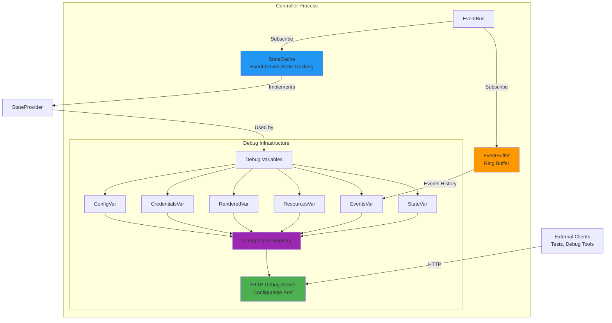

#### Runtime Introspection and Debugging

The controller provides comprehensive runtime introspection capabilities through an HTTP debug server, enabling production debugging, operational visibility, and acceptance testing without relying solely on logs.

##### Architecture Overview



##### Key Components

**pkg/introspection** - Generic debug HTTP server infrastructure:
- Instance-based variable registry (not global like expvar)
- HTTP handlers for `/debug/vars` endpoints
- JSONPath field selection support (kubectl-style syntax)
- Go profiling integration (`/debug/pprof`)
- Graceful shutdown with context

**pkg/events/ringbuffer** - Event history storage:
- Thread-safe circular buffer using Go generics
- Fixed-size with automatic old-item eviction
- O(1) add, O(n) retrieval performance
- Used by both EventCommentator and EventBuffer

**pkg/controller/debug** - Controller-specific debug variables:
- Implements `introspection.Var` interface for controller data
- ConfigVar, CredentialsVar (metadata only), RenderedVar, ResourcesVar
- EventBuffer for independent event tracking
- StateProvider interface for accessing controller state

**StateCache** - Event-driven state tracking:
- Subscribes to validation, rendering, and resource events
- Maintains current state snapshot in memory
- Thread-safe RWMutex-protected access
- Implements StateProvider interface for debug endpoints
- Prevents need to query EventBus for historical state

##### HTTP Endpoints

The debug server exposes controller state via HTTP (port configurable via `--debug-port` flag or `DEBUG_PORT` environment variable, disabled by default):

```bash
# List all available variables (assuming port 6060 is configured)
curl http://localhost:6060/debug/vars

# Get current configuration
curl http://localhost:6060/debug/vars/config

# Get just the config version using JSONPath
curl 'http://localhost:6060/debug/vars/config?field={.version}'

# Get rendered HAProxy configuration
curl http://localhost:6060/debug/vars/rendered

# Get resource counts
curl http://localhost:6060/debug/vars/resources

# Get recent events (last 1000)
curl http://localhost:6060/debug/vars/events

# Get recent 100 events
curl 'http://localhost:6060/debug/vars/events?field={.last_100}'

# Get complete state dump
curl http://localhost:6060/debug/vars/state

# Go profiling
curl http://localhost:6060/debug/pprof/
curl http://localhost:6060/debug/pprof/heap
curl http://localhost:6060/debug/pprof/goroutine
```

##### Event History

Two independent event tracking mechanisms:

**EventCommentator** (observability):
- Subscribes to all events for domain-aware logging
- Ring buffer for event correlation in log messages
- Produces rich contextual log output
- Lives in pkg/controller/commentator

**EventBuffer** (debugging):
- Subscribes to all events for debug endpoint access
- Simplified event representation for HTTP API
- Exposes last N events via `/debug/vars/events`
- Lives in pkg/controller/debug

This separation allows different buffer sizes, retention policies, and use cases without coupling logging to debugging infrastructure.

##### Integration with Acceptance Testing

The debug endpoints enable powerful acceptance testing:

```go
// tests/acceptance/debug_client.go
type DebugClient struct {
    podName   string
    debugPort int
}

// In test
func TestConfigMapReload(t *testing.T) {
    // Create debug client with port-forward
    debugClient := NewDebugClient(cfg.RESTConfig(), "controller-pod", 6060)
    debugClient.Start(ctx)

    // Update ConfigMap
    UpdateConfigMap(ctx, "new-template")

    // Wait for controller to process change
    err := debugClient.WaitForConfigVersion(ctx, "v2", 30*time.Second)
    require.NoError(t, err)

    // Verify rendered config includes changes
    rendered, err := debugClient.GetRenderedConfig(ctx)
    require.NoError(t, err)
    assert.Contains(t, rendered, "expected-content")

    // Verify event history
    events, err := debugClient.GetEvents(ctx)
    require.NoError(t, err)
    assert.Contains(t, events, "config.validated")
}
```

This enables true end-to-end testing without parsing logs or relying on timing heuristics.

##### Security Considerations

Debug variables implement careful filtering:

```go
// CredentialsVar returns metadata only
func (v *CredentialsVar) Get() (interface{}, error) {
    creds, version, err := v.provider.GetCredentials()
    if err != nil {
        return nil, err
    }

    return map[string]interface{}{
        "version":             version,
        "has_dataplane_creds": creds.DataplanePassword != "",
        // NEVER expose actual passwords
    }, nil
}
```

The debug server should be:
- Bound to localhost in production (kubectl port-forward for access)
- Protected by network policies
- Disabled or restricted in multi-tenant environments

##### Configuration

Debug server configuration via controller ConfigMap:

```yaml
controller:
  introspection:
    enabled: true
    port: 6060
    bind_address: "0.0.0.0"  # For kubectl port-forward compatibility

  debug:
    enabled: true
    event_buffer_size: 1000
    state_snapshots: true
```

For detailed implementation and API documentation, see:
- `pkg/introspection/README.md` - Generic debug HTTP server
- `pkg/events/ringbuffer/README.md` - Ring buffer implementation
- `pkg/controller/debug/README.md` - Controller-specific debug variables

