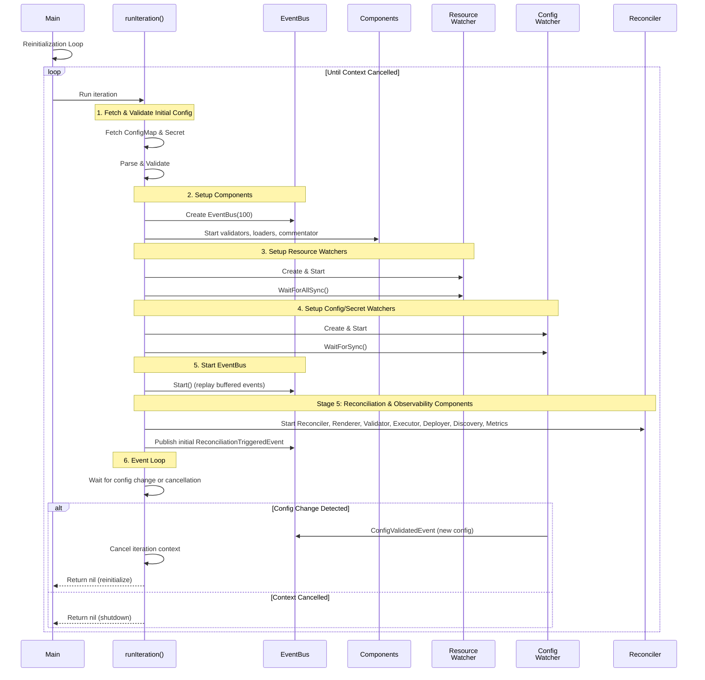
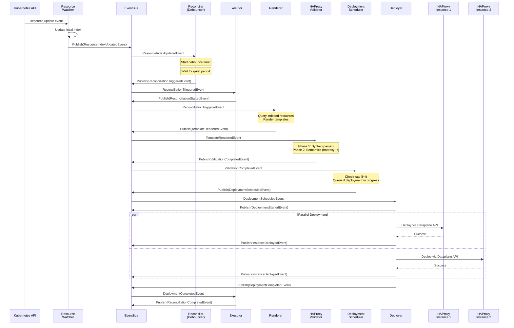
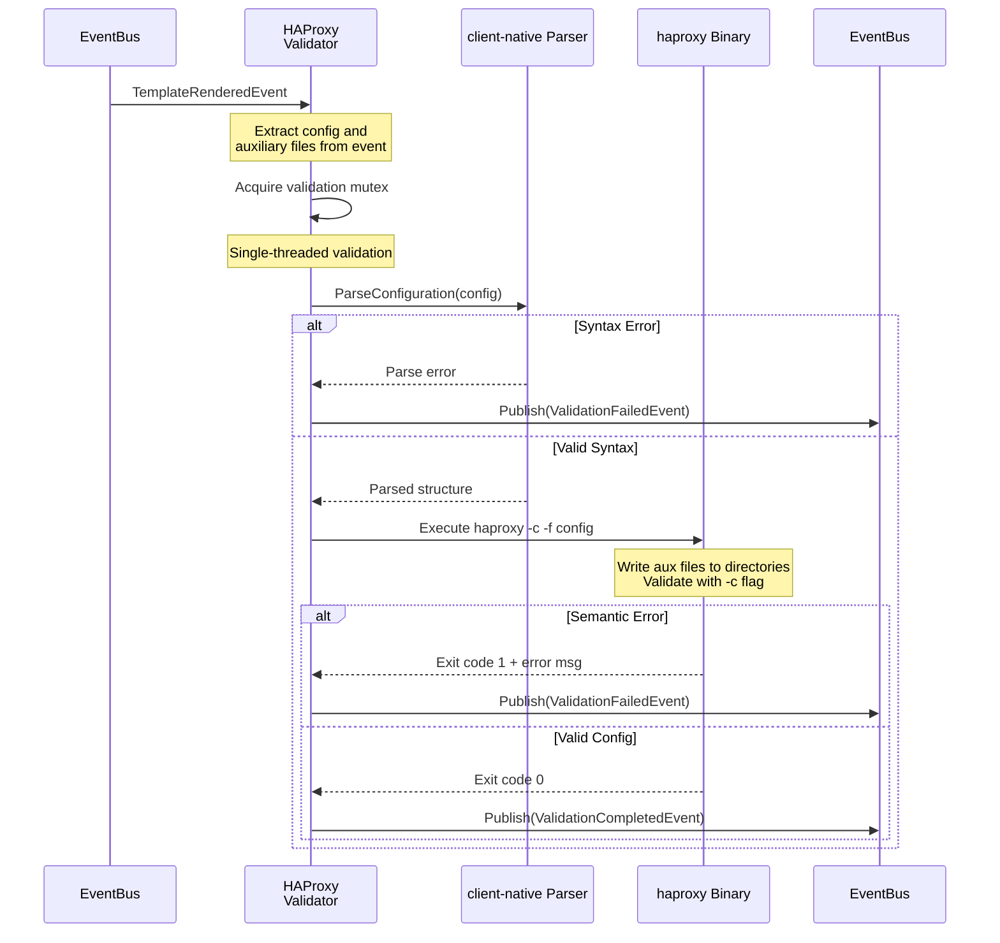
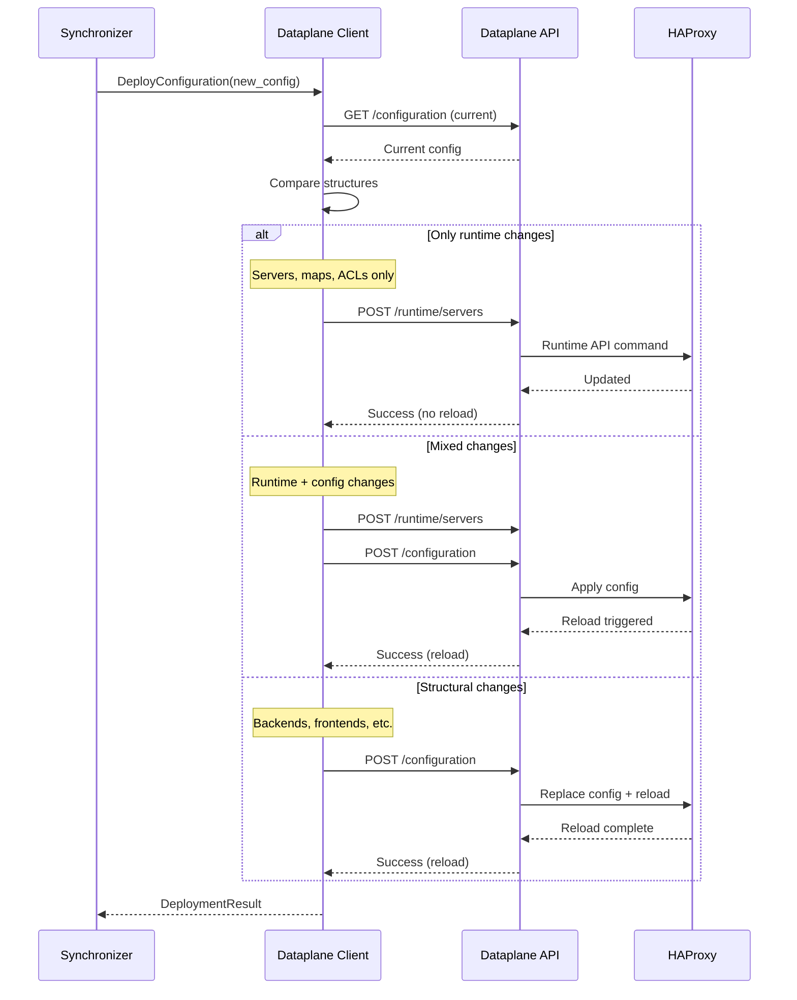

# Sequence Diagrams

## Startup and Initialization

The controller uses a **reinitialization loop** pattern where it responds to configuration changes by restarting with the new configuration. Each iteration follows these initialization steps:

**Reinitialization Loop Pattern:**

The controller runs iterations that respond to configuration changes:

1. **Initial Config Fetch**: Fetch and validate ConfigMap and Secret synchronously before starting components
2. **Component Setup**: Create EventBus and start config management components (validators, loaders, commentator)
3. **Resource Watchers**: Create watchers for configured resources and wait for initial sync
4. **Config Watchers**: Create watchers for ConfigMap and Secret, wait for sync
5. **EventBus Start**: Call EventBus.Start() to replay buffered events and begin normal operation
6. **Stage 5 - Reconciliation & Observability**: Start reconciliation components (Reconciler, Renderer, Validator, Executor, Deployer, Discovery) and observability components (Metrics, Debug HTTP servers)
7. **Event Loop**: Wait for configuration changes or context cancellation
8. **Reinitialization**: When config changes, cancel iteration context to stop all components, then restart with new config

This pattern ensures the controller always operates with validated configuration and handles configuration updates by cleanly restarting with the new settings. The Stage 5 label is explicitly used in code for reconciliation components; earlier stages are implicit in the initialization sequence. Metrics collection starts in Stage 5 after EventBus.Start() to ensure all event subscriptions are properly registered before metrics begin tracking events.

## Resource Change Handling

**Event-Driven Flow:**

1. **Resource Change**: ResourceWatcher receives Kubernetes event, updates local index, publishes ResourceIndexUpdatedEvent
2. **Debouncing**: Reconciler subscribes to index events, starts debounce timer to batch rapid changes
3. **Reconciliation Trigger**: After quiet period, Reconciler publishes ReconciliationTriggeredEvent
4. **Orchestration Start**: Executor subscribes to ReconciliationTriggeredEvent and publishes ReconciliationStartedEvent for observability
5. **Template Rendering**: Renderer component subscribes to ReconciliationTriggeredEvent, queries indexed resources, renders templates using pkg/templating, and publishes TemplateRenderedEvent with rendered configuration and auxiliary files
6. **Validation**: HAProxyValidator component subscribes to TemplateRenderedEvent, performs two-phase validation (syntax with client-native parser, semantics with haproxy binary via pkg/dataplane), and publishes ValidationCompletedEvent or ValidationFailedEvent
7. **Deployment Scheduling**: DeploymentScheduler subscribes to ValidationCompletedEvent, enforces minimum deployment interval (default 2s) for rate limiting, implements "latest wins" queueing if deployment is in progress, and publishes DeploymentScheduledEvent when ready
8. **Deployment Execution**: Deployer component subscribes to DeploymentScheduledEvent, executes parallel deployments to all discovered HAProxy endpoints using pkg/dataplane, publishes InstanceDeployedEvent for each instance and DeploymentCompletedEvent when all complete
9. **Completion**: Executor subscribes to DeploymentCompletedEvent and publishes ReconciliationCompletedEvent with duration metrics

All coordination happens via EventBus pub/sub. Components are fully event-driven with no direct function calls between them, enabling clean separation of concerns and independent testability.

## Configuration Validation Process

**Validation Steps:**

1. **Event Subscription**: HAProxyValidator component subscribes to TemplateRenderedEvent and receives rendered configuration and auxiliary files
   - Event-driven trigger - no direct function calls from Renderer
   - Decouples rendering from validation

2. **Mutex Acquisition**: Acquire validation mutex to ensure single-threaded validation
   - Prevents concurrent writes to HAProxy directories
   - Ensures consistent validation state

3. **Syntax Validation**: client-native library (pkg/dataplane) parses config structure
   - Checks grammar and syntax rules
   - Validates section structure
   - Returns parsing errors if invalid

4. **Semantic Validation**: haproxy binary performs full validation
   - Writes auxiliary files to configured HAProxy directories (maps, certs, general files)
   - Writes main configuration to configured path
   - Executes `haproxy -c -f /etc/haproxy/haproxy.cfg`
   - Checks resource availability (files referenced in config must exist)
   - Validates directive combinations
   - Verifies configuration coherence
   - Returns detailed error messages if invalid

5. **Event Publishing**: Validator publishes ValidationCompletedEvent or ValidationFailedEvent
   - Other components (Executor, DeploymentScheduler) subscribe to these events
   - Event-driven coordination continues the reconciliation workflow

## Zero-Reload Deployment Strategy

**Deployment Optimization:**

The synchronizer analyzes configuration changes to determine the optimal deployment strategy:

1. **Runtime-Only Updates**: Server additions/removals, map updates, ACL changes → No reload
2. **Mixed Updates**: Apply runtime changes first, then config changes → Single reload
3. **Structural Updates**: Backend/frontend changes → Full reload required

This minimizes service disruption by avoiding unnecessary HAProxy process reloads.
